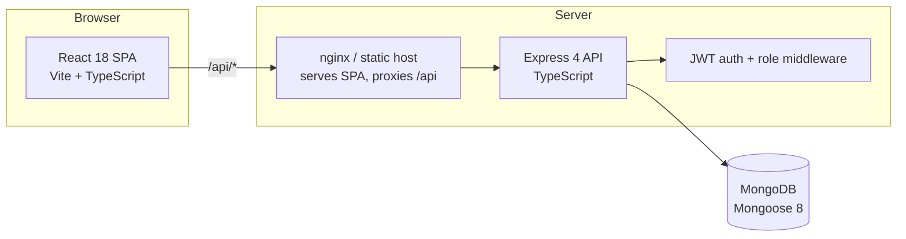
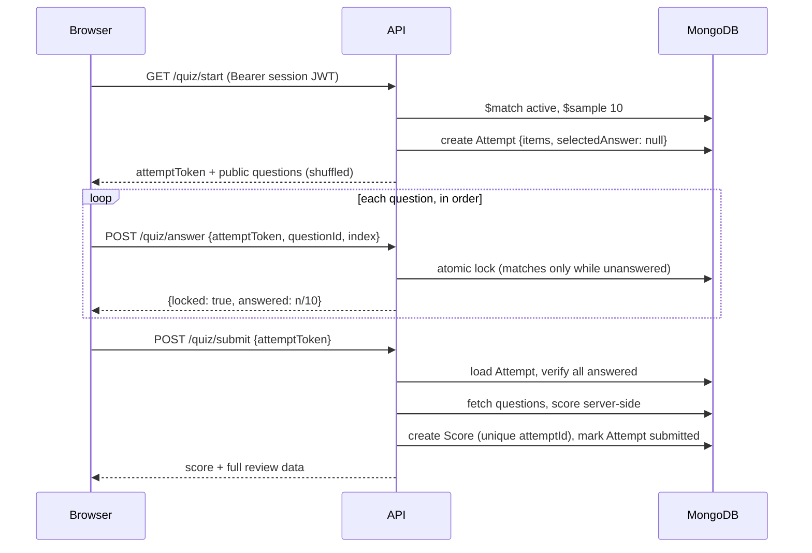

# Architecture

Survival Sydney is a full-stack TypeScript quiz app that tests how ready newcomers are for real life in Sydney. It is built around one design goal: **the recorded result must be trustworthy even against a hostile client** — otherwise the leaderboard and rank tiers mean nothing. This document explains the system layout, the exam-integrity model, and the key design decisions.

## System overview



- **Frontend** (`frontend/`): React 18 + Vite, strict TypeScript. State via React Context + a discriminated-union reducer. Route-level code splitting for admin/history/review/leaderboard bundles.
- **Backend** (`backend/`): Express 4 + Mongoose 8, strict TypeScript compiled with `tsc`. Consistent `{ success, data } / { success, error }` response envelopes on every route.
- **Database**: MongoDB. Four collections — `users`, `questions`, `scores`, `attempts`.

## The integrity model

A quiz result is only meaningful if the client cannot influence scoring. Survival Sydney enforces this with three cooperating mechanisms.

### 1. Signed attempt tokens

`GET /api/quiz/start` samples 10 random active questions, generates a fresh option permutation per question (Fisher–Yates), and signs the whole contract into a short-lived JWT (2 h TTL, HS256 pinned):

```jsonc
{
  "purpose": "quiz_attempt",      // never accepted as a session token
  "userId": "…",                  // bound to the authenticated user
  "attemptId": "<uuid>",          // replay-protection key
  "items": [ { "qid": "…", "order": [2, 0, 3, 1] }, … ]
}
```

The browser receives only public question data — answer keys and explanations never leave the server before submission. Because the option order is signed, the server can always map a displayed answer index back to the original correct-answer index without trusting the client.

### 2. Per-question server-side locking

Alongside the token, `start` creates a server-side `Attempt` record. Each answer is then locked one at a time via `POST /api/quiz/answer` with an **atomic** MongoDB update:

```ts
Attempt.findOneAndUpdate(
  {
    attemptId, userId, status: 'active',
    items: { $elemMatch: { questionId, selectedAnswer: null } }, // only while unanswered
  },
  { $set: { 'items.$.selectedAnswer': index, 'items.$.answeredAt': new Date() } },
)
```

The filter only matches while `selectedAnswer` is still `null`, so a locked answer can never be changed — including under concurrent or replayed requests. Questions must also be answered in presentation order, and every lock is timestamped, giving a complete per-question audit trail.

### 3. Server-side scoring and replay protection

`POST /api/quiz/submit` sends **no answers**. The server scores exclusively from the locked `Attempt` record, refuses to finalise until all 10 questions are answered, and persists the result as a `Score` document. Replay is blocked twice: a pre-check on `attemptId`, and a unique index on `Score.attemptId` as the race-safe backstop.

### Attempt lifecycle



### Threat model

| Attack | Defence |
|---|---|
| Change an answer after moving on | Atomic lock only matches `selectedAnswer: null`; server rejects with 409 |
| Batch-forge answers at the end | `submit` accepts no answers; scoring reads only server-locked state |
| Swap in easier questions | Submitted `attemptId` binds to the signed question set; answers outside the attempt are rejected |
| Replay a finished attempt | `attemptId` pre-check + unique index on `Score.attemptId` |
| Use someone else's attempt token | Token carries `userId`; verified against the session on every call |
| Use an attempt token as a login token | Session middleware rejects any JWT carrying a `purpose` claim |
| Forge tokens via `alg: none` / algorithm confusion | All verification pins `algorithms: ['HS256']` |
| Guess a weak signing key | Server refuses to boot on placeholder or <32-char `JWT_SECRET` |
| Read answer keys before submitting | `correctAnswer`/`explanation` stripped from every pre-submit payload |
| Brute-force login / hammer endpoints | Per-route rate limits (login/register 5·min⁻¹ per IP; answer 60·min⁻¹, submit 20·min⁻¹ per user) behind proxy-aware IP handling |

## Data model

```mermaid
erDiagram
  USER ||--o{ SCORE : achieves
  USER ||--o{ ATTEMPT : takes
  ATTEMPT ||--|| SCORE : "finalises to"
  QUESTION }o--o{ ATTEMPT : "sampled into"

  USER { string username UK, email UK; string passwordHash; string role "user|admin" }
  QUESTION { string questionText UK; string4 options; int correctAnswer; bool active; string topic }
  ATTEMPT { string attemptId UK; ref userId; enum status; date expiresAt "TTL"; items[] "qid, order, selectedAnswer, answeredAt" }
  SCORE { ref userId; string attemptId UK; int score; answers[] "qid, selected, isCorrect, optionOrder" }
```

Key indexes: unique `Score.attemptId` (replay backstop), compound `Score {userId, score, createdAt}` (covers the leaderboard aggregation and history filter), unique `Question.questionText` (race-safe duplicate guard), TTL on `Attempt.expiresAt` (abandoned attempts self-clean when their token could no longer be used).

`Score.answers[i].optionOrder` persists the exact shuffle each player saw, so Review Mode and history re-render the attempt identically — including after the question bank changes.

## Authentication

- Session JWTs (HS256, 2 h) carry `{ userId, role }`; the user is **re-fetched from the database on every request**, so deletions and role changes take effect immediately.
- Passwords are bcrypt-hashed (configurable work factor).
- Admin and player route families are mutually exclusive: `admin.middleware` gates the admin API, `forbidAdminQuiz.middleware` blocks admins from play routes, and the SPA mirrors both.
- The client keeps the JWT in `localStorage` — a deliberate simplicity trade-off, mitigated by short expiry, algorithm pinning, purpose separation, and a strict CORS allow-list. A 401 from any endpoint broadcasts a session-expired event that logs out globally.

## Frontend state machine

The quiz flow is a reducer-driven state machine (`QuizContext`), typed as a 12-arm discriminated union:

```
gate → start → quiz (×10, answer locked server-side per question)
     → calculating (submit fires immediately; animation is a minimum hold, not a gate)
     → result (server-computed review)
```

Design points worth noting:

- **Persistence is decoupled from animation.** The submit request fires the moment the last answer is given; the "calculating" screen enforces only a minimum display time. Leaving mid-animation cannot lose a completed attempt.
- An active-quiz navigation guard intercepts refresh, back navigation, and in-app links while an attempt is live.
- Answer buttons disable in flight; a failed lock unlocks the question with a visible error rather than silently advancing.

## Testing and CI

- **Backend**: 48 Jest + Supertest integration tests against a real MongoDB — covering the full attempt lifecycle, per-question lock semantics (double-answer, out-of-order, incomplete submit), token tampering/replay/cross-user cases, authorization boundaries (IDOR), admin CRUD, and the JWT secret guard.
- **Frontend**: 24 Vitest + Testing Library tests over the quiz reducer, route guards, and forms.
- **CI** (GitHub Actions): lint → typecheck (`tsc`) → test → build for both packages, with a MongoDB service container for backend integration tests. Vite alone does not type-check, so `tsc --noEmit` is a separate gate.

## Decision log

| Decision | Rationale |
|---|---|
| Signed token **and** server-side Attempt record | The token makes the question/order contract tamper-evident; the record enables per-question locking and auditing. Neither alone covers both. |
| Per-question lock via conditional atomic update | A read-check-write sequence would race; `$elemMatch` + positional `$set` makes lock acquisition a single atomic operation. |
| Scoring only from server state | Removes the entire class of client-forged-result bugs; the client is reduced to a display layer. |
| HS256 pinned everywhere | Single-service deployment needs no asymmetric keys; pinning kills `alg`-substitution attacks cheaply. |
| Fail-fast secret validation | A weak `JWT_SECRET` silently breaks every guarantee above, so it is a boot-time hard failure, not a warning. |
| MongoDB TTL for attempts | Abandoned attempts expire exactly when their token does; no cron or cleanup job required. |
| Response envelopes on every route | One error contract for the SPA; the axios layer normalises transport errors into the same shape. |
