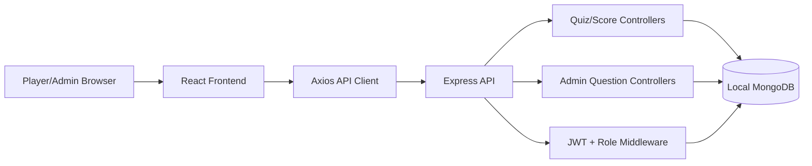

# COMP5347 Assignment 2 - MERN Quiz Platform

[English](README.md) | [中文](README.zh-CN.md)

A full-stack single-player quiz application built for COMP5347 Assignment 2. The player experience is themed around a Sydney Life Survival Quiz for international students, with registration/login, a dynamic 10-question quiz flow, Review Mode after completion, history pages, backend leaderboard data, and an admin interface for managing the question bank.

## 🧭 At a Glance

| Item | Value |
|---|---|
| Approved variation | Review Mode after completion |
| Quiz length | Fixed 10 questions |
| One-command demo | `npm run demo` |
| Admin demo account | `admin` / `AdminPass123` |
| Player demo accounts | `player1` / `PlayerPass123`, `player2` / `PlayerPass123` |
| Seeded question bank | 50 Sydney life questions from the source JSON |
| Frontend visual theme | Sydney University ochre/orange-red and charcoal styling with Sydney-life landing copy |
| API docs | `http://localhost:5001/api-docs` |

## 🧩 Features

- Local username/password authentication with bcrypt and JWT.
- Role-based access control for player and admin workflows.
- Dynamic quiz attempts generated from active questions.
- Sydney life question bank with question text, four options, correct answer index, active state, and optional explanation.
- Fixed-length quiz generation from active questions.
- Fixed 10-question attempts for comparable leaderboard scores.
- Product-style Sydney Life Quiz landing page aligned to the seeded question-bank theme and a USYD-inspired ochre/orange-red and charcoal colour system.
- One answer per question, locked after selection.
- Review Mode with selected answers, correctness, correct answers, and explanations while source questions still exist.
- Admin CRUD, active/inactive toggle, and JSON bulk import with validation.
- Persistent dark mode across player and admin interfaces.
- Swagger API docs and Postman collection.
- Backend Supertest/Jest coverage for core API flows.

## 🧱 Tech Stack

| Layer | Technology |
|---|---|
| Frontend | React, Vite, React Router, Context + useReducer |
| Forms | React Hook Form, Zod |
| Backend | Node.js, Express |
| Database | Local MongoDB, Mongoose |
| Auth | bcrypt, JSON Web Token |
| API docs | Swagger/OpenAPI, Postman |
| Testing | Jest, Supertest |

## 👥 Team Roles

| Member | Role | Primary subsystem |
|---|---|---|
| Tracy Cui | A | Authentication, JWT, role checks, login/register UI |
| Raven Ge | B | Quiz flow, scoring, Review Mode, history, leaderboard data |
| Allen Ji | C | Admin question CRUD, active toggle, bulk import |
| Tom Tian | D | Integration, response envelope, error handling, theme, docs, tests |

Representative subsystem ownership is also marked in the main backend/frontend entry files.

## 🔀 Git Workflow and Marker Evidence

The repository is hosted on Sydney University GitHub Enterprise:

```text
https://github.sydney.edu.au/wege8390/COMP4347-COMP5347-Assignment-2--Group5
```

The final integration branch is `dev`, and final release should be merged to `main` after the group has reviewed and verified the complete implementation. To inspect contribution history locally:

```bash
git log --all --graph --oneline --decorate
git shortlog -sne --all
```

Each student's individual reflection should cite their own selected commit evidence and explain the subsystem decisions they personally owned.

## 🚀 Quick Start

### Prerequisites

- Node.js 20 or later
- npm
- Docker, for local MongoDB

### One-Command Demo

```bash
npm run demo
```

This command prepares local `.env` files when they are missing, installs missing dependencies, starts a Docker MongoDB container when no local MongoDB is reachable, seeds demo questions and demo users, and then starts the backend and frontend together.

- Frontend: `http://localhost:5173`
- Backend: `http://localhost:5001`
- Swagger UI: `http://localhost:5001/api-docs`
- Admin login: `admin` / `AdminPass123`
- Player logins: `player1` / `PlayerPass123`, `player2` / `PlayerPass123`

To stop only the demo MongoDB container created by the helper:

```bash
npm run demo:stop
```

### Manual Setup

#### 1. Start Local MongoDB

```bash
docker run -d -p 27017:27017 --name mongo mongo:7
```

The backend defaults to:

```bash
MONGODB_URI=mongodb://localhost:27017/comp5347_quiz
```

#### 2. Install Dependencies

```bash
npm install
npm run install:all
```

#### 3. Configure Environment

```bash
cp backend/.env.example backend/.env
cp frontend/.env.example frontend/.env
```

Backend environment:

```bash
JWT_SECRET=replace-with-a-long-local-secret
JWT_EXPIRES_IN=2h
MONGODB_URI=mongodb://localhost:27017/comp5347_quiz
CLIENT_ORIGIN=http://localhost:5173
```

Frontend environment:

```bash
VITE_API_BASE_URL=http://localhost:5001/api
```

The backend refuses to start without `JWT_SECRET` outside the Jest test environment.

#### 4. Seed Demo Data

```bash
npm run seed --prefix backend
```

Seeded admin account:

```text
username: admin
password: AdminPass123
```

Seeded player accounts:

```text
username: player1
password: PlayerPass123

username: player2
password: PlayerPass123
```

The seed also creates 50 active Sydney life questions from `backend/src/seeds/data/sydney_life_survival_quiz_50_questions.json`. The source bank covers arrival basics, transport, housing and consumer rights, work/tax/health, and safety/scam awareness for international students, giving the fixed 10-question quiz enough surplus inventory for varied random attempts.

#### 5. Run the App

```bash
npm run dev
```

- Backend: `http://localhost:5001`
- Frontend: `http://localhost:5173`
- Swagger UI: `http://localhost:5001/api-docs`

## 🗂️ Project Structure

```text
.
├── backend/                 # Express API, Mongoose models, tests, Swagger
├── frontend/                # React/Vite application
├── docs/                    # Architecture, Postman, manual checks, readiness notes
├── package.json             # Root helper scripts
└── README.md
```

## 🏗️ Architecture



The backend returns consistent response envelopes from `backend/src/utils/responseEnvelope.js`. The frontend uses `frontend/src/api/api.js` for quiz and admin API calls, and protected requests include a bearer JWT.

## 👀 Review Mode Variation

The approved variation is Review Mode after completion. After submitting a quiz, users can review every answered question, their selected answer, whether it was correct, the correct answer, and optional explanation text.

Variation scope boundary: Review Mode is the only approved variation implemented. The app does not implement timed questions, a category-selection quiz flow, image-based questions, multiplayer, real-time behaviour, adaptive branching, metadata-balanced sampling, or any alternative scoring scheme.

Design decisions:

- `Question.explanation` is optional so the question bank can be populated gradually.
- `Score.answers` stores `questionId`, `selectedAnswer`, and `isCorrect`.
- The app intentionally uses `Question` and `Score` collections, not a persisted `Quiz` collection.
- Review/history endpoints rebuild review details from the current `Question` documents and show a deleted-question placeholder if the source question no longer exists.

## 🏆 Quiz and Leaderboard Rules

- Quiz length: fixed 10 questions.
- Question selection: backend randomly samples 10 active questions per attempt.
- Scoring: +1 per correct answer only.
- Leaderboard: backend returns the best score per user, sorted by score descending. The backend leaderboard endpoint is currently public; the frontend `/leaderboard` route is protected but still renders a placeholder. Tie-break ordering and admin-score filtering need quiz/leaderboard owner follow-up before final submission.

## 📘 API Documentation

- Swagger UI: `http://localhost:5001/api-docs`
- Postman collection: [`docs/postman-collection.json`](docs/postman-collection.json)
- Security and validation map: [`docs/security-validation.md`](docs/security-validation.md)

Key route groups:

- `/api/auth/register`, `/api/auth/login`, `/api/auth/me`
- `/api/quiz/start`, `/api/quiz/submit`, `/api/quiz/history`, `/api/quiz/history/:id`, `/api/quiz/leaderboard`
- `/api/admin/questions`, `/api/admin/questions/:id`, `/api/admin/questions/:id/toggle`, `/api/admin/questions/bulk-import`

## 🔒 Security and Validation

| Requirement | Implementation |
|---|---|
| Local authentication | Users register/log in with username and password; passwords are hashed with bcrypt before storage. |
| JWT protected routes | Quiz start, submit, history/review, and admin routes require `Authorization: Bearer <token>`; the current backend leaderboard endpoint is public even though the frontend route is protected. |
| Backend RBAC | `/api/admin/*` routes require both authentication and `role === "admin"`. |
| Frontend RBAC | Admin navigation and `/admin` are restricted by `ProtectedRoute adminOnly`. |
| Rate limiting | Login uses `express-rate-limit` via `backend/src/middleware/rateLimiters.js`; quiz submit has a limiter helper defined but not mounted. |
| Server validation | Auth routes use Zod validators; quiz and admin controllers use explicit request checks plus Mongoose validation. |
| Injection/XSS protection | `helmet`, `express-mongo-sanitize`, strict validation, and React's default escaping are used; the app does not render user HTML. |
| Error safety | Global error middleware hides 5xx internals and keeps failure responses in the same envelope shape. |

## 🛠️ Scripts

```bash
npm run demo              # prepare env, MongoDB, seed data, then run the full demo
npm run demo:stop         # stop the helper-created demo MongoDB container
npm run install:all       # install backend and frontend dependencies
npm run dev               # run backend and frontend together
npm test --prefix backend # run backend Jest/Supertest suite
npm run build --prefix frontend
```

## ✅ Verification

```bash
npm test --prefix backend -- --runInBand
npm run build --prefix frontend
python3 -m json.tool docs/postman-collection.json >/dev/null
JWT_SECRET=test-local-secret node -e "require('./backend/src/app'); console.log('app-load-ok')"
git diff --check
```

The backend suite includes Supertest API coverage for auth, quiz start/submit/history/review data, leaderboard, admin access, admin CRUD, and invalid bulk import indexes.

Additional manual checks are listed in [`docs/manual-test-checklist.md`](docs/manual-test-checklist.md). Delivery readiness notes are tracked in [`docs/delivery-readiness.md`](docs/delivery-readiness.md).

## ✨ Additional Evidence

The current implementation keeps a practical Sydney-life question bank, unified API response envelopes, JWT/RBAC protection, login rate limiting, frontend form validation, and a themed React shell. Avoid claiming metadata-balanced sampling, durable deleted-question snapshots, or `/api/quiz/review/:attemptId` unless those features are implemented in a later branch.
