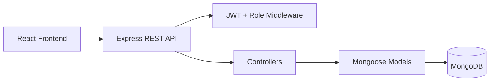
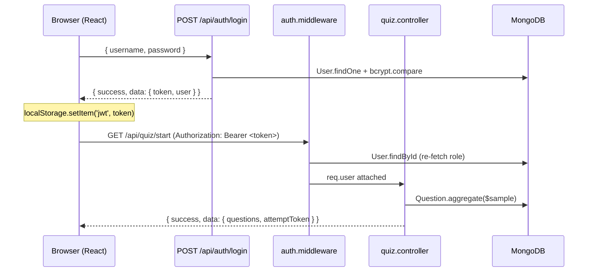

# COMP5347 Assignment 2 - MERN Quiz Game

Single-player MERN quiz game with a player quiz flow, Review Mode after completion, leaderboard, attempt history, and a protected admin question-management interface.

## Key Information

| Item | Value |
|---|---|
| Approved variation | Review Mode after completion |
| Quiz length | 10 questions per attempt |
| Frontend | `http://localhost:5173` |
| Backend | `http://localhost:5001` |
| API docs | `http://localhost:5001/api-docs` |
| Admin login URL | `http://localhost:5173/admin/login` (alias: `/bosscoming`) |
| Admin account | `admin` / `AdminPass123` |
| Player accounts | `player1` / `PlayerPass123`, `player2` / `PlayerPass123` |

## Features

- User registration, login, logout, and JWT-based protected routes.
- Player quiz flow: 10 random active questions per attempt; option order shuffled per question.
- Each question has exactly four options and one correct answer.
- One answer per question; selecting locks the choice and auto-advances; answers cannot be changed after submit.
- Submit requires the signed `attemptToken` from start (user-bound question set and option order; replay-protected).
- Final score is saved with user ID, score, timestamp, and full answer list.
- Review Mode shows answers and explanations; wrong items expand by default, correct items stay collapsed.
- Leaderboard shows the top 50 players ranked by each user's best score; when scores tie, the player who first achieved that score on an attempt ranks higher.
- Past attempts can be viewed from the history page.
- Admin interface supports question create, edit, delete, active/inactive toggle, and JSON bulk import.
- Dark mode is persisted in `localStorage`.
- Backend uses response envelopes: success `{ success: true, data }`, failure `{ success: false, error }`. The implementation also attaches optional metadata fields (`statusCode`, `code`, `details`, `meta`) on top of the required shape for debugging and pagination — these are extensions, not replacements, so the spec-required keys remain authoritative.
- Login/register and quiz submission endpoints use rate limiting.

## Tech Stack

| Layer | Tools |
|---|---|
| Frontend | React, Vite, React Router |
| State | React Context + `useReducer` |
| Forms | React Hook Form + Zod |
| Backend | Node.js, Express |
| Database | MongoDB, Mongoose |
| Auth | bcrypt, JWT |
| Docs/Tests | Swagger, Postman, Jest, Supertest, Vitest, React Testing Library |

## Setup

### 1. Install dependencies

```bash
npm install
npm run install:all
```

### 2. Create environment files

```bash
cp backend/.env.example backend/.env
cp frontend/.env.example frontend/.env
```

Example backend `.env`:

```env
MONGODB_URI=mongodb://localhost:27017/comp5347_quiz
JWT_SECRET=replace-with-a-long-secret
JWT_EXPIRES_IN=2h
BCRYPT_ROUNDS=10
CLIENT_ORIGIN=http://localhost:5173
PORT=5001
```

Example frontend `.env`:

```env
VITE_API_BASE_URL=http://localhost:5001/api
```

### 3. Start MongoDB

```bash
docker run -d -p 27017:27017 --name comp5347-quiz-mongo mongo:7
```

### 4. Seed demo data

```bash
npm run seed --prefix backend
```

### 5. Run the app

```bash
npm run dev
```

Open:

- Player site: `http://localhost:5173`
- Admin login: `http://localhost:5173/admin/login` (alias: `/bosscoming`)
- API documentation: `http://localhost:5001/api-docs`

### Troubleshooting

- If port `5001` or `5173` is already in use, stop the old backend/frontend process and rerun `npm run dev`.
- If MongoDB is unavailable, start the Docker container from step 3 or update `MONGODB_URI` to a running local MongoDB instance.
- If login fails after editing env files, confirm `JWT_SECRET` is set in `backend/.env` and restart the backend.
- If the quiz has no questions, rerun `npm run seed --prefix backend`.
- If the frontend cannot reach the API, confirm `VITE_API_BASE_URL=http://localhost:5001/api` and restart Vite.

## One-Command Demo

The project also includes a helper script:

```bash
npm run demo
```

This prepares local env files, checks MongoDB, seeds demo data, and starts frontend and backend together.

To stop the helper MongoDB container:

```bash
npm run demo:stop
```

## Architecture Summary



The diagram above shows the static layering. The sequence below shows a typical authenticated request — login then a protected quiz call — so the JWT and middleware hops are explicit:



Main backend structure:

```text
backend/src/
  config/
  controllers/
  docs/
  middleware/
  models/
  routes/
  seeds/
  tests/
  utils/
  validators/
```

Main frontend structure:

```text
frontend/src/
  api/
  components/
  contexts/
  pages/
```

## Review Mode Variation

The approved assignment variation is **Review Mode after completion**.

After a quiz is submitted, the backend stores the full answer list in the `Score` model. The user can then review each question, their selected answer, whether it was correct, the correct answer, and the explanation when available.

Because the approved variation is Review Mode, there is no pre-quiz category selection step; topics are surfaced per question and summarised in result/history views.

This project does not implement timed questions, category selection, image-based questions, multiplayer, real-time features, adaptive branching, or alternative scoring schemes.

## Quiz Logic and Attempt Integrity

Question order is randomised per attempt through MongoDB `$sample`. Option order is also generated freshly per attempt; the backend signs the per-question option permutation into a short-lived `attemptToken` returned from `GET /api/quiz/start`. The same token must be sent back to `POST /api/quiz/submit` and is rejected if missing, tampered, expired, bound to a different user, or replayed.

The `attemptToken` TTL is fixed at 2 hours in `backend/src/config/quiz.js`, matching the provided `JWT_EXPIRES_IN=2h` example. This is a security expiry only; it is not a timed-quiz mechanic and does not affect scoring. Review Mode persists the option order to `Score.answers[i].optionOrder` so history and review pages render options in the same order the player originally saw them.

## Beyond the Specification — Bonus Features

This project includes several additions beyond the minimum A2 requirements. Each item is documented with what was added, why it was added, and how it integrates with the rest of the system, following Ed Discussion #143.

### Bonus Mark Mapping

The three bonus dimensions from the assessment rubric map to the evidence below.

| Rubric bonus dimension | Where it is evidenced in this repository |
|---|---|
| **Exceptional robustness** | Signed `attemptToken` binds each attempt to the authenticated user, exact question IDs, and the shuffled option order (`backend/src/utils/quizAttemptToken.js`); replay protection via both controller pre-check and a unique `Score.attemptId` index; per-attempt `optionOrder` persistence so Review Mode renders the same order the player originally saw; `helmet`, `express-mongo-sanitize`, and per-user rate-limit `keyGenerator` (`req.user?.id \|\| req.ip`); `ActiveQuizNavigationGuard` confirms before refresh, `popstate`, and in-app link clicks while a quiz is active. |
| **Especially thoughtful edge case handling** | "Not enough active questions" returns 400 with a clear message instead of crashing; distinct `Attempt token expired` / `Invalid attempt token` / `Attempt token does not belong to current user` messages; duplicate-submission attempts return 409 (controller pre-check + unique index); deleted questions in history render `[Question deleted]` without breaking the review payload; bulk import reports per-row errors as `Question N: <reason>` with the offending index; empty-string explanations become `null` and render as a fallback review note; corrupted `localStorage` JSON is caught in `AuthContext`; loading / error / empty triple state on every player page; wildcard 404 route. |
| **Extremely clear system integration** | Shared success `{ success: true, data }` and failure `{ success: false, error }` response envelopes on every route via `backend/src/utils/responseEnvelope.js`; shared `QUIZ_LENGTH` / `OPTIONS_PER_QUESTION` constants consumed by controllers, models, and validators (`backend/src/config/quiz.js`); auth middleware re-fetches the user and attaches `toSafeObject()` so `/me` and `/login` emit the same shape (the Pair 1 contract); single `AuthContext` restores the session on mount via `/api/auth/me`; admin and player route families are mutually exclusive (`admin.middleware` + `forbidAdminQuiz.middleware`) and documented under §Main API Routes; dual API documentation (`/api-docs` Swagger UI + `docs/postman-collection.json`) mirrors the same routes for cross-tool verification. |

### Robustness highlights

- Signed attempt tokens bind each quiz attempt to the authenticated user, exact question IDs, and the shuffled option order.
- Replay protection is enforced by both a controller pre-check and a unique `Score.attemptId` index.
- `optionOrder` persistence lets Review Mode and history render the same option order the player originally saw.
- Edge cases for invalid tokens, wrong users, duplicate question IDs, malformed answers, admin-player boundary violations, and rate limits return consistent response envelopes.

### Active-quiz navigation guard

- **What:** The app confirms before a player leaves an in-progress quiz through refresh, browser back navigation, internal links, or logout.
- **Why:** This protects players from accidental progress loss and reduces the refresh-until-easy-question pattern.
- **How it integrates:** `ActiveQuizNavigationGuard` is mounted in `frontend/src/App.jsx` and reads `QuizContext.hasActiveQuiz`; it handles `beforeunload`, `popstate`, and document-level link clicks while the quiz is active.

### Dual API documentation

- **What:** The backend serves Swagger UI at `/api-docs`, and the repository also includes `docs/postman-collection.json`.
- **Why:** Swagger supports quick browser inspection, while Postman gives markers a ready-to-run request collection.
- **How it integrates:** `backend/src/docs/swagger.js` is loaded by `backend/src/app.js`, and the Postman collection mirrors the same auth, quiz, and admin endpoints.

### Signed attempt replay protection

- **What:** Quiz attempts carry a signed `attemptToken` with the exact question IDs and option order shown to the player.
- **Why:** It prevents client-side answer-key reconstruction, cross-user submission, tampering, and duplicate replay of the same attempt.
- **How it integrates:** `backend/src/utils/quizAttemptToken.js`, `backend/src/controllers/quiz.controller.js`, and `backend/src/models/Score.js` work together to sign, verify, persist, and enforce unique attempt IDs.

### Theme transition polish

- **What:** The UI supports persisted light/dark themes with a `document.startViewTransition` enhancement where the browser supports it.
- **Why:** The quiz keeps a consistent visual identity while making theme switching feel deliberate instead of abrupt.
- **How it integrates:** `frontend/src/contexts/ThemeContext.jsx` owns the persisted theme state and is consumed by the shared navbars and theme toggle components.

### Immersive admin sign-in entry

- **What:** Admin users sign in through `/admin/login` (with `/bosscoming` retained as an alias), a themed admin entry point that reuses the normal auth form with admin-mode validation.
- **Why:** It separates the admin workflow visually without creating a second authentication mechanism; the `/admin/login` path follows the conventional admin URL pattern markers expect, while `/bosscoming` stays as a thematic shortcut.
- **How it integrates:** `frontend/src/App.jsx` routes both `/admin/login` and `/bosscoming` to the shared login component with `adminMode`, and protected admin pages still rely on backend role checks.

### Accessibility and feedback polish

- **What:** The interface includes ARIA labels, live/status regions, consistent response envelopes, and friendly error states for auth, quiz, and admin actions.
- **Why:** These details improve usability and make failures easier to understand during marking or live demo.
- **How it integrates:** Frontend components use `aria-*`/`role` attributes, while backend controllers and middleware return shared success `{ success: true, data }` and failure `{ success: false, error }` envelopes.

## Main API Routes

| Area | Routes |
|---|---|
| Auth | `POST /api/auth/register`, `POST /api/auth/login`, `GET /api/auth/me` |
| Quiz | `GET /api/quiz/start`, `POST /api/quiz/submit`, `GET /api/quiz/history`, `GET /api/quiz/history/:id`, `GET /api/quiz/leaderboard` |
| Admin | `GET /api/admin/questions`, `POST /api/admin/questions`, `PUT /api/admin/questions/:id`, `DELETE /api/admin/questions/:id`, `PATCH /api/admin/questions/:id/toggle`, `POST /api/admin/questions/bulk-import` |

Admin accounts are intentionally blocked from player quiz routes: `GET /api/quiz/start`, `POST /api/quiz/submit`, `GET /api/quiz/history`, `GET /api/quiz/history/:id`, and `GET /api/quiz/leaderboard`. The admin responsibility is question management, not gameplay, so the backend enforces this boundary with `forbidAdminQuiz` and the frontend mirrors it with `<ProtectedRoute blockAdmin>`.

Full API documentation is available at:

```text
http://localhost:5001/api-docs
```

A Postman collection is also provided in:

```text
docs/postman-collection.json
```

## Team Roles

| Member | Primary responsibility |
|---|---|
| Tracy Cui | Authentication, JWT, role checks, login/register UI |
| Raven Ge | Quiz flow, scoring, Review Mode, history, leaderboard |
| Allen Ji | Admin question CRUD, active toggle, bulk import |
| Tom Tian | Integration, response envelope, validation, theme, docs, tests |

## Git Workflow and Commit Evidence

The project was developed on Sydney GitHub Enterprise using feature branches and pull requests. The assessment-ready branch is `main`; `final` is the development integration branch and now mirrors `main` after the final merge.

Markers can inspect the preserved commit history with:

```bash
git fetch --all
git log --all --graph --decorate --oneline
git log origin/final --author="Tracy Cui"
git log origin/final --author="RachlGew"
git log origin/final --author="f1sh11"
git log origin/final --author="Tom Tian"
git log origin/final --author="Tom_Tian"
```

Some commits appear under GitHub usernames, including `RachlGew` for Raven Ge and `f1sh11` for Allen Ji. Tom Tian also has four early commits under the personal alias `Tom_Tian`; include both `Tom Tian` and `Tom_Tian` when checking Tom's contribution history. A handful of early commits from Allen Ji (`f1sh11 <jijoinyucheng@gmail.com>`) and Tom Tian (`Tom_Tian <tys1328056247@gmail.com>`) were authored from personal Gmail addresses before the uni email was configured locally; the GitHub username on each commit still matches the same contributor, so `git log --author="f1sh11"` and `git log --author="Tom_Tian"` will surface those entries alongside the uni-email commits.

Representative commits for each subsystem:

| Member | Subsystem | Representative commits |
|---|---|---|
| Tracy Cui | Authentication, JWT, role checks, login/register UI | [`1642971`](https://github.sydney.edu.au/wege8390/COMP4347-COMP5347-Assignment-2--Group5/commit/16429718e940bdf68013f30a73ee41a4bac647ba) auth routes with rate limiting and Swagger docs; [`dac2108`](https://github.sydney.edu.au/wege8390/COMP4347-COMP5347-Assignment-2--Group5/commit/dac21086da074f224f9858c299e4c91347ac86a4) register validation hardening; [`be281ed`](https://github.sydney.edu.au/wege8390/COMP4347-COMP5347-Assignment-2--Group5/commit/be281ed5447059fa64e7509f9c745897255f9ae6) ProtectedRoute localStorage guard |
| Raven Ge | Quiz flow, scoring, Review Mode, history, leaderboard | [`62ca283`](https://github.sydney.edu.au/wege8390/COMP4347-COMP5347-Assignment-2--Group5/commit/62ca283f94bfde49d79dc16cd85a3ceed2f8ce6f) quiz frontend flow and review system; [`268d0c6`](https://github.sydney.edu.au/wege8390/COMP4347-COMP5347-Assignment-2--Group5/commit/268d0c6e35037c88528fce9a5414dbabe0f64376) quiz logic and UI updates; [`41f7ce8`](https://github.sydney.edu.au/wege8390/COMP4347-COMP5347-Assignment-2--Group5/commit/41f7ce813ecf55f73e652c63f52e8a9d728b1bb2) quiz question logic fix |
| Allen Ji | Admin question CRUD, active toggle, bulk import | [`2479978`](https://github.sydney.edu.au/wege8390/COMP4347-COMP5347-Assignment-2--Group5/commit/2479978f04643eb7fd4cd7705a8fe6e0862cf40e) admin question controller and protected routes; [`df3c0cc`](https://github.sydney.edu.au/wege8390/COMP4347-COMP5347-Assignment-2--Group5/commit/df3c0cc1b6b0af0fa415bb05868f26b1411565b6) admin dashboard form and bulk import; [`284fd25`](https://github.sydney.edu.au/wege8390/COMP4347-COMP5347-Assignment-2--Group5/commit/284fd25a2882c1eec7b30b5cb0ae68c4ff50898f) admin controller tests |
| Tom Tian | Integration, response envelope, validation, theme, docs, tests | [`7a61d82`](https://github.sydney.edu.au/wege8390/COMP4347-COMP5347-Assignment-2--Group5/commit/7a61d826193c0c4f375b5dc81d967e154051665e) bootstrap layout and project hygiene; [`972fc77`](https://github.sydney.edu.au/wege8390/COMP4347-COMP5347-Assignment-2--Group5/commit/972fc7706a4a59432248ece76562b1e994dd63b2) integration QA docs and tests; [`bba8b06`](https://github.sydney.edu.au/wege8390/COMP4347-COMP5347-Assignment-2--Group5/commit/bba8b06d27da0633a2bf5de5a2b6a95674b21bb9) shuffled-answer API test alignment; [`d0d07f6`](https://github.sydney.edu.au/wege8390/COMP4347-COMP5347-Assignment-2--Group5/commit/d0d07f6f64aa6d90b45fc7cf07b5a2b875b005ce) quiz route error-response documentation |

Each individual reflection PDF in `docs/individual-reflections/` provides the fuller technical explanation and commit evidence for that member.

## Test and Build

```bash
npm test --prefix backend
npm test --prefix frontend
npm run build --prefix frontend
```

## Submission Notes

- Do not include `node_modules` in the submitted ZIP.
- The group coversheet is included as `Assignment 2 Group Assignment Coversheet.pdf`.
- Individual reflection PDFs are included under `docs/individual-reflections/` with commit evidence, subsystem explanation, challenge, diagram, and Review Mode design reflection.
