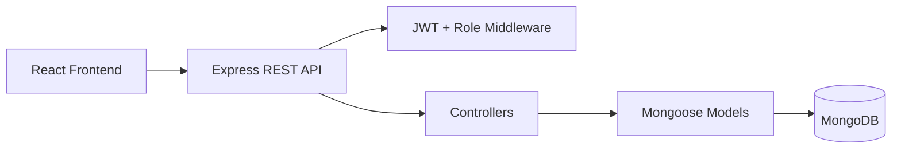

# COMP5347 Assignment 2 - MERN Quiz Game

Single-player MERN quiz game with a player quiz flow, Review Mode after completion, leaderboard, attempt history, and a protected admin question-management interface.

## Key Information

| Item | Value |
|---|---|
| Approved variation | Review Mode after completion |
| Quiz length | 10 questions per attempt |
| Frontend | `http://localhost:5173` |
| Backend | `http://localhost:5001` |
| API docs | `http://localhost:5001/api-docs` |
| Admin login URL | `http://localhost:5173/bosscoming` |
| Admin account | `admin` / `AdminPass123` |
| Player accounts | `player1` / `PlayerPass123`, `player2` / `PlayerPass123` |

## Features

- User registration, login, logout, and JWT-based protected routes.
- Player quiz flow using 10 randomly selected active questions.
- Each question has exactly four options and one correct answer.
- One answer can be selected per question; submitted answers cannot be changed.
- Final score is saved with user ID, score, timestamp, and full answer list.
- Review Mode shows selected answers, correctness, correct answers, and explanations.
- Leaderboard shows each user's best score, highest first.
- Past attempts can be viewed from the history page.
- Admin interface supports question create, edit, delete, active/inactive toggle, and JSON bulk import.
- Dark mode is persisted in `localStorage`.
- Backend uses response envelope format: `{ success, data?, error? }`.
- Login/register and quiz submission endpoints use rate limiting.

## Tech Stack

| Layer | Tools |
|---|---|
| Frontend | React, Vite, React Router |
| State | React Context + `useReducer` |
| Forms | React Hook Form + Zod |
| Backend | Node.js, Express |
| Database | MongoDB, Mongoose |
| Auth | bcrypt, JWT |
| Docs/Tests | Swagger, Postman, Jest, Supertest |

## Setup

### 1. Install dependencies

```bash
npm install
npm run install:all
```

### 2. Create environment files

```bash
cp backend/.env.example backend/.env
cp frontend/.env.example frontend/.env
```

Example backend `.env`:

```env
MONGODB_URI=mongodb://localhost:27017/comp5347_quiz
JWT_SECRET=replace-with-a-long-secret
JWT_EXPIRES_IN=2h
BCRYPT_ROUNDS=10
CLIENT_ORIGIN=http://localhost:5173
PORT=5001
```

Example frontend `.env`:

```env
VITE_API_BASE_URL=http://localhost:5001/api
```

### 3. Start MongoDB

```bash
docker run -d -p 27017:27017 --name mongo mongo:7
```

### 4. Seed demo data

```bash
npm run seed --prefix backend
```

### 5. Run the app

```bash
npm run dev
```

Open:

- Player site: `http://localhost:5173`
- Admin login: `http://localhost:5173/bosscoming`
- API documentation: `http://localhost:5001/api-docs`

## One-Command Demo

The project also includes a helper script:

```bash
npm run demo
```

This prepares local env files, checks MongoDB, seeds demo data, and starts frontend and backend together.

To stop the helper MongoDB container:

```bash
npm run demo:stop
```

## Architecture Summary



Main backend structure:

```text
backend/src/
  config/
  controllers/
  middleware/
  models/
  routes/
  seeds/
  tests/
```

Main frontend structure:

```text
frontend/src/
  api/
  components/
  contexts/
  pages/
```

## Review Mode Variation

The approved assignment variation is **Review Mode after completion**.

After a quiz is submitted, the backend stores the full answer list in the `Score` model. The user can then review each question, their selected answer, whether it was correct, the correct answer, and the explanation when available.

This project does not implement timed questions, category selection, image-based questions, multiplayer, real-time features, adaptive branching, or alternative scoring schemes.

## Main API Routes

| Area | Routes |
|---|---|
| Auth | `POST /api/auth/register`, `POST /api/auth/login`, `GET /api/auth/me` |
| Quiz | `GET /api/quiz/start`, `POST /api/quiz/submit`, `GET /api/quiz/history`, `GET /api/quiz/history/:id`, `GET /api/quiz/leaderboard` |
| Admin | `GET /api/admin/questions`, `POST /api/admin/questions`, `PATCH /api/admin/questions/:id`, `DELETE /api/admin/questions/:id`, `PATCH /api/admin/questions/:id/toggle`, `POST /api/admin/questions/bulk` |

Full API documentation is available at:

```text
http://localhost:5001/api-docs
```

A Postman collection is also provided in:

```text
docs/postman-collection.json
```

## Team Roles

| Member | Primary responsibility |
|---|---|
| Tracy Cui | Authentication, JWT, role checks, login/register UI |
| Raven Ge | Quiz flow, scoring, Review Mode, history, leaderboard |
| Allen Ji | Admin question CRUD, active toggle, bulk import |
| Tom Tian | Integration, response envelope, validation, theme, docs, tests |

## Test and Build

```bash
npm test --prefix backend -- --runInBand
npm run build --prefix frontend
```

## Submission Notes

- Do not include `node_modules` in the submitted ZIP.
- Include the group coversheet if required by Canvas submission.
- Each student should submit their individual contribution reflection with commit evidence, subsystem explanation, challenge, diagram, and Review Mode design reflection.
