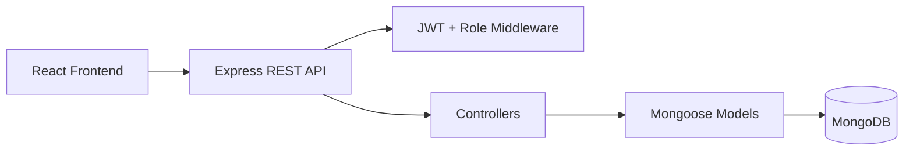

# COMP5347 Assignment 2 - MERN Quiz Game

Single-player MERN quiz game with a player quiz flow, Review Mode after completion, leaderboard, attempt history, and a protected admin question-management interface.

## Key Information

| Item | Value |
|---|---|
| Approved variation | Review Mode after completion |
| Quiz length | 10 questions per attempt |
| Frontend | `http://localhost:5173` |
| Backend | `http://localhost:5001` |
| API docs | `http://localhost:5001/api-docs` |
| Admin login URL | `http://localhost:5173/bosscoming` |
| Admin account | `admin` / `AdminPass123` |
| Player accounts | `player1` / `PlayerPass123`, `player2` / `PlayerPass123` |

## Features

- User registration, login, logout, and JWT-based protected routes.
- Player quiz flow using 10 randomly selected active questions.
- Each question has exactly four options and one correct answer.
- One answer can be selected per question; submitted answers cannot be changed.
- Final score is saved with user ID, score, timestamp, and full answer list.
- Review Mode shows selected answers, correctness, correct answers, and explanations.
- Leaderboard shows each user's best score, highest first.
- Past attempts can be viewed from the history page.
- Admin interface supports question create, edit, delete, active/inactive toggle, and JSON bulk import.
- Dark mode is persisted in `localStorage`.
- Backend uses response envelope format: `{ success, data?, error? }`.
- Login/register and quiz submission endpoints use rate limiting.

## Tech Stack

| Layer | Tools |
|---|---|
| Frontend | React, Vite, React Router |
| State | React Context + `useReducer` |
| Forms | React Hook Form + Zod |
| Backend | Node.js, Express |
| Database | MongoDB, Mongoose |
| Auth | bcrypt, JWT |
| Docs/Tests | Swagger, Postman, Jest, Supertest |

## Setup

### 1. Install dependencies

```bash
npm install
npm run install:all
```

### 2. Create environment files

```bash
cp backend/.env.example backend/.env
cp frontend/.env.example frontend/.env
```

Example backend `.env`:

```env
MONGODB_URI=mongodb://localhost:27017/comp5347_quiz
JWT_SECRET=replace-with-a-long-secret
JWT_EXPIRES_IN=2h
BCRYPT_ROUNDS=10
CLIENT_ORIGIN=http://localhost:5173
PORT=5001
```

Example frontend `.env`:

```env
VITE_API_BASE_URL=http://localhost:5001/api
```

### 3. Start MongoDB

```bash
docker run -d -p 27017:27017 --name mongo mongo:7
```

### 4. Seed demo data

```bash
npm run seed --prefix backend
```

### 5. Run the app

```bash
npm run dev
```

Open:

- Player site: `http://localhost:5173`
- Admin login: `http://localhost:5173/bosscoming`
- API documentation: `http://localhost:5001/api-docs`

## One-Command Demo

The project also includes a helper script:

```bash
npm run demo
```

This prepares local env files, checks MongoDB, seeds demo data, and starts frontend and backend together.

To stop the helper MongoDB container:

```bash
npm run demo:stop
```

## Architecture Summary



Main backend structure:

```text
backend/src/
  config/
  controllers/
  middleware/
  models/
  routes/
  seeds/
  tests/
```

Main frontend structure:

```text
frontend/src/
  api/
  components/
  contexts/
  pages/
```

## Review Mode Variation

The approved assignment variation is **Review Mode after completion**.

After a quiz is submitted, the backend stores the full answer list in the `Score` model. The user can then review each question, their selected answer, whether it was correct, the correct answer, and the explanation when available.

This project does not implement timed questions, category selection, image-based questions, multiplayer, real-time features, adaptive branching, or alternative scoring schemes.

## Beyond the Specification — Bonus Features

This project includes several additions beyond the minimum A2 requirements. Each item is documented with what was added, why it was added, and how it integrates with the rest of the system, following Ed Discussion #143.

### Active-quiz navigation guard

- **What:** The app confirms before a player leaves an in-progress quiz through refresh, browser back navigation, internal links, or logout.
- **Why:** This protects players from accidental progress loss and reduces the refresh-until-easy-question pattern.
- **How it integrates:** `ActiveQuizNavigationGuard` is mounted in `frontend/src/App.jsx` and reads `QuizContext.hasActiveQuiz`; it handles `beforeunload`, `popstate`, and document-level link clicks while the quiz is active.

### Dual API documentation

- **What:** The backend serves Swagger UI at `/api-docs`, and the repository also includes `docs/postman-collection.json`.
- **Why:** Swagger supports quick browser inspection, while Postman gives markers a ready-to-run request collection.
- **How it integrates:** `backend/src/docs/swagger.js` is loaded by `backend/src/app.js`, and the Postman collection mirrors the same auth, quiz, and admin endpoints.

### Theme transition polish

- **What:** The UI supports persisted light/dark themes with a `document.startViewTransition` enhancement where the browser supports it.
- **Why:** The quiz keeps a consistent visual identity while making theme switching feel deliberate instead of abrupt.
- **How it integrates:** `frontend/src/contexts/ThemeContext.jsx` owns the persisted theme state and is consumed by the shared navbars and theme toggle components.

### Immersive admin sign-in entry

- **What:** Admin users sign in through `/bosscoming`, a themed admin entry point that reuses the normal auth form with admin-mode validation.
- **Why:** It separates the admin workflow visually without creating a second authentication mechanism.
- **How it integrates:** `frontend/src/App.jsx` routes `/bosscoming` to the shared login component with `adminMode`, and protected admin pages still rely on backend role checks.

### Accessibility and feedback polish

- **What:** The interface includes ARIA labels, live/status regions, consistent response envelopes, and friendly error states for auth, quiz, and admin actions.
- **Why:** These details improve usability and make failures easier to understand during marking or live demo.
- **How it integrates:** Frontend components use `aria-*`/`role` attributes, while backend controllers and middleware return the shared `{ success, data?, error? }` envelope.

## Main API Routes

| Area | Routes |
|---|---|
| Auth | `POST /api/auth/register`, `POST /api/auth/login`, `GET /api/auth/me` |
| Quiz | `GET /api/quiz/start`, `POST /api/quiz/submit`, `GET /api/quiz/history`, `GET /api/quiz/history/:id`, `GET /api/quiz/leaderboard` |
| Admin | `GET /api/admin/questions`, `POST /api/admin/questions`, `PUT /api/admin/questions/:id`, `DELETE /api/admin/questions/:id`, `PATCH /api/admin/questions/:id/toggle`, `POST /api/admin/questions/bulk-import` |

Full API documentation is available at:

```text
http://localhost:5001/api-docs
```

A Postman collection is also provided in:

```text
docs/postman-collection.json
```

## Team Roles

| Member | Primary responsibility |
|---|---|
| Tracy Cui | Authentication, JWT, role checks, login/register UI |
| Raven Ge | Quiz flow, scoring, Review Mode, history, leaderboard |
| Allen Ji | Admin question CRUD, active toggle, bulk import |
| Tom Tian | Integration, response envelope, validation, theme, docs, tests |

## Git Workflow and Commit Evidence

The project was developed on Sydney GitHub Enterprise using feature branches and pull requests. The assessment-ready branch is `final`; `main` is not the delivery branch.

Markers can inspect the preserved commit history with:

```bash
git fetch --all
git log --all --graph --decorate --oneline
git log origin/final --author="Tracy Cui"
git log origin/final --author="RachlGew"
git log origin/final --author="f1sh11"
git log origin/final --author="Tom Tian"
```

Some commits appear under GitHub usernames, including `RachlGew` for Raven Ge and `f1sh11` for Allen Ji.

Representative commits for each subsystem:

| Member | Subsystem | Representative commits |
|---|---|---|
| Tracy Cui | Authentication, JWT, role checks, login/register UI | [`1642971`](https://github.sydney.edu.au/wege8390/COMP4347-COMP5347-Assignment-2--Group5/commit/16429718e940bdf68013f30a73ee41a4bac647ba) auth routes with rate limiting and Swagger docs; [`dac2108`](https://github.sydney.edu.au/wege8390/COMP4347-COMP5347-Assignment-2--Group5/commit/dac21086da074f224f9858c299e4c91347ac86a4) register validation hardening; [`be281ed`](https://github.sydney.edu.au/wege8390/COMP4347-COMP5347-Assignment-2--Group5/commit/be281ed5447059fa64e7509f9c745897255f9ae6) ProtectedRoute localStorage guard |
| Raven Ge | Quiz flow, scoring, Review Mode, history, leaderboard | [`62ca283`](https://github.sydney.edu.au/wege8390/COMP4347-COMP5347-Assignment-2--Group5/commit/62ca283f94bfde49d79dc16cd85a3ceed2f8ce6f) quiz frontend flow and review system; [`268d0c6`](https://github.sydney.edu.au/wege8390/COMP4347-COMP5347-Assignment-2--Group5/commit/268d0c6e35037c88528fce9a5414dbabe0f64376) quiz logic and UI updates; [`41f7ce8`](https://github.sydney.edu.au/wege8390/COMP4347-COMP5347-Assignment-2--Group5/commit/41f7ce813ecf55f73e652c63f52e8a9d728b1bb2) quiz question logic fix |
| Allen Ji | Admin question CRUD, active toggle, bulk import | [`2479978`](https://github.sydney.edu.au/wege8390/COMP4347-COMP5347-Assignment-2--Group5/commit/2479978f04643eb7fd4cd7705a8fe6e0862cf40e) admin question controller and protected routes; [`df3c0cc`](https://github.sydney.edu.au/wege8390/COMP4347-COMP5347-Assignment-2--Group5/commit/df3c0cc1b6b0af0fa415bb05868f26b1411565b6) admin dashboard form and bulk import; [`284fd25`](https://github.sydney.edu.au/wege8390/COMP4347-COMP5347-Assignment-2--Group5/commit/284fd25a2882c1eec7b30b5cb0ae68c4ff50898f) admin controller tests |
| Tom Tian | Integration, response envelope, validation, theme, docs, tests | [`7a61d82`](https://github.sydney.edu.au/wege8390/COMP4347-COMP5347-Assignment-2--Group5/commit/7a61d826193c0c4f375b5dc81d967e154051665e) bootstrap layout and project hygiene; [`972fc77`](https://github.sydney.edu.au/wege8390/COMP4347-COMP5347-Assignment-2--Group5/commit/972fc7706a4a59432248ece76562b1e994dd63b2) integration QA docs and tests; [`bba8b06`](https://github.sydney.edu.au/wege8390/COMP4347-COMP5347-Assignment-2--Group5/commit/bba8b06d27da0633a2bf5de5a2b6a95674b21bb9) shuffled-answer API test alignment; [`d0d07f6`](https://github.sydney.edu.au/wege8390/COMP4347-COMP5347-Assignment-2--Group5/commit/d0d07f6f64aa6d90b45fc7cf07b5a2b875b005ce) quiz route error-response documentation |

Each individual reflection PDF provides the fuller technical explanation and commit evidence for that member.

## Test and Build

```bash
npm test --prefix backend -- --runInBand
npm run build --prefix frontend
```

## Submission Notes

- Do not include `node_modules` in the submitted ZIP.
- Include the group coversheet if required by Canvas submission.
- Each student should submit their individual contribution reflection with commit evidence, subsystem explanation, challenge, diagram, and Review Mode design reflection.
