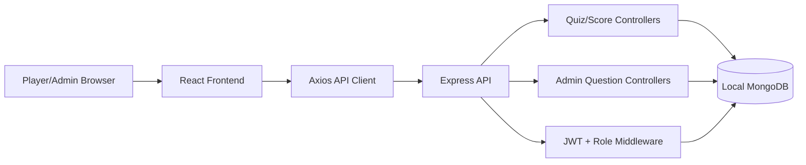

# COMP5347 Assignment 2 - MERN Quiz Platform

[English](README.md) | [中文](README.zh-CN.md)

这是为 COMP5347 Assignment 2 构建的全栈单人 Quiz 应用。玩家端体验围绕面向留学生的 Sydney Life Survival Quiz 主题组织，包含注册/登录、动态 10 题答题流程、完成后的 Review Mode、排行榜/历史记录，以及用于管理题库的 Admin 界面。

## 🧭 快速概览

| 项目 | 内容 |
|---|---|
| Approved variation | 完成后的 Review Mode |
| Quiz 长度 | 固定 10 题 |
| 一键运行 | `npm run demo` |
| Admin demo 账号 | `admin` / `AdminPass123` |
| Player demo 账号 | `player1` / `PlayerPass123`, `player2` / `PlayerPass123` |
| Seed 题库 | 50 道悉尼生活题，覆盖 5 个 category 和 3 个 difficulty |
| 前端视觉主题 | Sydney University 赭橙/橙红 + 炭黑风格，并使用悉尼生活题库相关首页文案 |
| API 文档 | `http://localhost:5001/api-docs` |

## 🧩 功能特性

- 本地用户名/密码认证，使用 bcrypt 和 JWT。
- 玩家/Admin 角色权限控制。
- 从 active questions 动态生成 quiz attempts。
- 悉尼生活题库带 topic 和 difficulty 元数据。
- 抽题按 foundation/application/analysis 做难度覆盖，并在题库允许时限制 topic 重复。
- 固定 10 题，保证排行榜分数可比较。
- 产品化的 Sydney Life Quiz 首页已对齐 seed 题库主题，并采用 USYD 风格的赭橙/橙红 + 炭黑视觉系统。
- 每题只能选择一次，选择后锁定。
- Review Mode 展示分数环、用户答案、正确/错误、正确答案、explanation，以及可折叠的答案详情。
- 已完成 attempt 保存题目快照，即使题目后续被编辑或删除仍可 review。
- Admin 题目 CRUD、active/inactive toggle、JSON 批量导入和校验。
- Player/Admin 共用的持久化 dark mode。
- Swagger API 文档和 Postman collection。
- 后端 Supertest/Jest 覆盖核心 API 流程。

## 🧱 技术栈

| 层级 | 技术 |
|---|---|
| Frontend | React, Vite, React Router, Context + useReducer |
| Forms | React Hook Form, Zod |
| Backend | Node.js, Express |
| Database | 本地 MongoDB, Mongoose |
| Auth | bcrypt, JSON Web Token |
| API docs | Swagger/OpenAPI, Postman |
| Testing | Jest, Supertest |

## 👥 团队分工

| 成员 | 角色 | 主要子系统 |
|---|---|---|
| Tracy Cui | A | Authentication, JWT, role checks, login/register UI |
| Raven Ge | B | Quiz flow, scoring, Review Mode, history, leaderboard data |
| Allen Ji | C | Admin question CRUD, active toggle, bulk import |
| Tom Tian | D | Integration, response envelope, error handling, theme, docs, tests |

主要后端/前端入口文件中也标注了对应 subsystem ownership。

## 🔀 Git Workflow 与 Marker Evidence

仓库托管在 Sydney University GitHub Enterprise：

```text
https://github.sydney.edu.au/wege8390/COMP4347-COMP5347-Assignment-2--Group5
```

最终集成分支是 `dev`，小组 review 并验证完整实现后再合并到 `main`。Marker 可以在本地用以下命令查看贡献历史：

```bash
git log --all --graph --oneline --decorate
git shortlog -sne --all
```

每位同学的 Individual Reflection 应单独引用自己的 commit evidence，并解释自己负责的 subsystem decisions。

## 🚀 快速开始

### 前置要求

- Node.js 20 或更高版本
- npm
- Docker，用于本地 MongoDB

### 一键运行 Demo

```bash
npm run demo
```

这个命令会在本地 `.env` 文件缺失时自动创建它们，安装缺失依赖，在本地 MongoDB 不可用时启动 Docker MongoDB container，写入 demo 题目和 demo 用户，然后同时启动 backend 和 frontend。

- Frontend: `http://localhost:5173`
- Backend: `http://localhost:5001`
- Swagger UI: `http://localhost:5001/api-docs`
- Admin login: `admin` / `AdminPass123`
- Player logins: `player1` / `PlayerPass123`, `player2` / `PlayerPass123`

如需只停止该 helper 创建的 demo MongoDB container：

```bash
npm run demo:stop
```

### 手动配置

#### 1. 启动本地 MongoDB

```bash
docker run -d -p 27017:27017 --name mongo mongo:7
```

后端默认连接：

```bash
MONGODB_URI=mongodb://localhost:27017/comp5347_quiz
```

#### 2. 安装依赖

```bash
npm install
npm run install:all
```

#### 3. 配置环境变量

```bash
cp backend/.env.example backend/.env
cp frontend/.env.example frontend/.env
```

后端环境变量：

```bash
JWT_SECRET=replace-with-a-long-local-secret
JWT_EXPIRES_IN=2h
MONGODB_URI=mongodb://localhost:27017/comp5347_quiz
CLIENT_ORIGIN=http://localhost:5173
```

前端环境变量：

```bash
VITE_API_BASE_URL=http://localhost:5001/api
```

在 Jest test 环境之外，如果没有配置 `JWT_SECRET`，后端会拒绝启动。

#### 4. 写入演示数据

```bash
npm run seed --prefix backend
```

Seed 后的 admin 账号：

```text
username: admin
password: AdminPass123
```

Seed 后的 player 账号：

```text
username: player1
password: PlayerPass123

username: player2
password: PlayerPass123
```

Seed 同时会从 `backend/src/seeds/data/sydney_life_survival_quiz_50_questions.json` 创建 50 道悉尼生活 active questions。题库覆盖抵达基础、交通、租房与消费权益、工作/税务/健康，以及安全/海滩/防诈骗，给固定 10 题 quiz 提供足够余量。

#### 5. 运行应用

```bash
npm run dev
```

- Backend: `http://localhost:5001`
- Frontend: `http://localhost:5173`
- Swagger UI: `http://localhost:5001/api-docs`

## 🗂️ 项目结构

```text
.
├── backend/                 # Express API, Mongoose models, tests, Swagger
├── frontend/                # React/Vite application
├── docs/                    # 架构、Postman、手测清单、交付准备记录
├── package.json             # 根目录辅助脚本
└── README.md
```

## 🏗️ 系统架构



后端通过 `backend/src/utils/responseEnvelope.js` 返回统一 response envelope。前端通过 `frontend/src/api/api.js` 访问 quiz/admin API，受保护请求会携带 bearer JWT。

## 👀 Review Mode Variation

本组批准的 variation 是完成答题后的 Review Mode。提交 quiz 后，用户可以查看每道题、自己的选择、是否正确、正确答案和可选 explanation。

Variation scope boundary：Review Mode 是唯一已实现的 approved variation。本应用没有实现 timed questions、用户先选择 category 的 quiz flow、image-based questions、multiplayer、real-time behaviour、adaptive branching 或任何替代计分规则。`Question.topic` 和 `Question.difficulty` 只是用于题库覆盖、admin auditability 和 balanced sampling 的元数据；它们不是 Categorised Quiz variation，因为用户开始 quiz 前不会选择 category。

设计决策：

- `Question.explanation` 是 optional，方便题库逐步补充解析。
- `Question.topic` 和 `Question.difficulty` 让题库覆盖面可检查，并支持更均衡的抽题。
- `Score.answers` 保存 `questionId`、`selectedAnswer`、`isCorrect` 和题目快照。
- 短期内存 quiz session 绑定 start 时抽到的题目和 submit 请求，不新增持久化 `Quiz` collection。
- Review/history endpoints 使用已保存快照，并在原题仍存在时结合 Mongoose population；即使题目被编辑或删除，已完成 attempt 仍可 review。

## 🏆 Quiz 与排行榜规则

- Quiz 长度：固定 10 题。
- 题目选择：后端每次从 active questions 中抽取 10 题，目标为 3 道 foundation、4 道 application、3 道 analysis，并在 active 题库允许时限制 topic 重复。
- 计分：每道正确答案 +1，无负分。
- 排行榜：每个用户展示最佳成绩，按分数降序排序；同分时更早提交者排前。

## 📘 API 文档

- Swagger UI: `http://localhost:5001/api-docs`
- Postman collection: [`docs/postman-collection.json`](docs/postman-collection.json)
- Security and validation map: [`docs/security-validation.md`](docs/security-validation.md)

主要路由组：

- `/api/auth/register`, `/api/auth/login`, `/api/auth/me`
- `/api/quiz/start`, `/api/quiz/submit`, `/api/quiz/history`, `/api/quiz/review/:attemptId`, `/api/quiz/leaderboard`
- `/api/admin/questions`, `/api/admin/questions/:id`, `/api/admin/questions/:id/toggle`, `/api/admin/bulk-import`

## 🔒 Security 与 Validation

| 要求 | 实现 |
|---|---|
| 本地认证 | 用户通过 username/password 注册和登录；密码入库前使用 bcrypt hash。 |
| JWT protected routes | 受保护路由要求 `Authorization: Bearer <token>`；JWT payload 包含用户角色。 |
| Backend RBAC | `/api/admin/*` 同时要求已认证且 `role === "admin"`。 |
| Frontend RBAC | Admin 导航和 `/admin` 通过 `ProtectedRoute adminOnly` 限制。 |
| Rate limiting | Login 和 quiz submit 通过 `backend/src/middleware/rateLimiters.js` 使用 `express-rate-limit`。 |
| Server validation | Auth、quiz submit、admin CRUD、toggle、bulk import 请求均使用 Zod validators。 |
| Injection/XSS protection | 使用 `helmet`、`express-mongo-sanitize`、严格 validation，以及 React 默认 escaping；应用不渲染用户 HTML。 |
| Error safety | 全局 error middleware 隐藏 5xx 内部细节，并保持统一 failure envelope。 |

## 🛠️ 常用脚本

```bash
npm run demo              # 准备 env、MongoDB、seed data，然后运行完整 demo
npm run demo:stop         # 停止 helper 创建的 demo MongoDB container
npm run install:all       # 安装 backend 和 frontend 依赖
npm run dev               # 同时运行 backend 和 frontend
npm test --prefix backend # 运行后端 Jest/Supertest 测试
npm run build --prefix frontend
```

## ✅ 验证命令

```bash
npm test --prefix backend -- --runInBand
npm run build --prefix frontend
python3 -m json.tool docs/postman-collection.json >/dev/null
JWT_SECRET=test-local-secret node -e "require('./backend/src/app'); console.log('app-load-ok')"
git diff --check
```

后端测试覆盖 auth、quiz session、review snapshot、admin access、admin CRUD 和 invalid bulk import index 等核心路径。

更多手测步骤见 [`docs/manual-test-checklist.md`](docs/manual-test-checklist.md)。交付准备记录见 [`docs/delivery-readiness.md`](docs/delivery-readiness.md)。

## ✨ Bonus-Eligible Evidence

SPEC 允许最多 +5 bonus，方向包括 exceptional UI/UX polish、增强 approved variation 的 thoughtful features，以及强错误处理和用户反馈。下面这些是按 What / Why / How-it-integrates 格式记录的 bonus candidates。Dark mode、React Hook Form + Zod、response envelope、JWT protection、rate limiting 这类 mandatory baseline 已在上方 core compliance 中说明，不作为独立 bonus claim。

### 带元数据的题库

- What: seed 题库包含 50 道面向留学生的悉尼/NSW 生活常识题，覆盖 5 个 category 和 3 个 difficulty。
- Why: quiz 内容现在匹配实际学生生活场景，不再使用实现细节导向的 demo 技术题，同时仍保留足够 active questions 支撑 10 题随机抽取。
- How it integrates: `/api/quiz/start` 使用这些元数据，目标抽取 3 道 foundation、4 道 application、3 道 analysis，并在题库允许时限制同一 topic 重复出现。这提升了题库变化，但不会构成第二个 variation，因为玩家仍然只开始一个标准 quiz，不会先选择 category。

### 可持久 Review Snapshot

- What: completed attempts 保存包含 explanation 的题目快照。
- Why: 即使 admin 后续编辑或删除原题，用户仍能 review 自己当时回答的内容。
- How it integrates: `/api/quiz/start` 记录本次题目快照，`/api/quiz/submit` 将 review snapshot 写入 `Score.answers`，review/history 页面渲染后端展开后的 attempt data。

### Review Summary 与可折叠答案 Review

- What: Review Mode 展示 score ring、correct count、incorrect count、accuracy percentage、可折叠答案详情，并提供 Incorrect only filter。
- Why: 用户可以快速定位错题，不需要手动扫完 10 道题。
- How it integrates: `ReviewPage` 从 `/api/quiz/review/:attemptId` 返回的 completed attempt 中派生 summary；filter 只在前端筛选展示，不改变数据库分数。

### Review Learning Breakdown

- What: Review Mode 按 topic 拆解表现，并提供可展开的待复习错题快捷入口。
- Why: 用户可以看出哪些知识区域需要加强，并直接跳到相关错题。
- How it integrates: `ReviewPage` 从现有 completed-attempt payload 派生 breakdown。它只加深 Review Mode，不改变 quiz selection、scoring、persistence 或 approved variation boundary。

### Actionable Validation and Import Errors

- What: validation failures 会显示字段级错误，bulk import failures 会报告无效 item 的 index 和 path。
- Why: admin 和 player 可以直接修正错误输入，不需要猜测哪里失败。
- How it integrates: 前端表单提交前校验，后端 Zod validators 返回结构化 envelope errors，`BulkImport` 渲染 item/path-specific issues，并避免插入部分无效数据。

### Accessible Feedback 与 Empty States

- What: 关键 loading、answer locked、protected-route login notices、success 和 empty states 使用清晰可见的提示，并在合适位置加入 `role="status"`、`role="alert"` 或 `aria-live`。
- Why: quiz、history、leaderboard、login 和 admin 流程中的反馈更明确，也照顾键盘和 screen-reader 用户。
- How it integrates: 所有 polish 都保留在现有 React pages/components 和 shared CSS 中，不新增运行时依赖。
