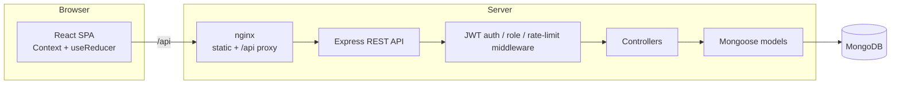
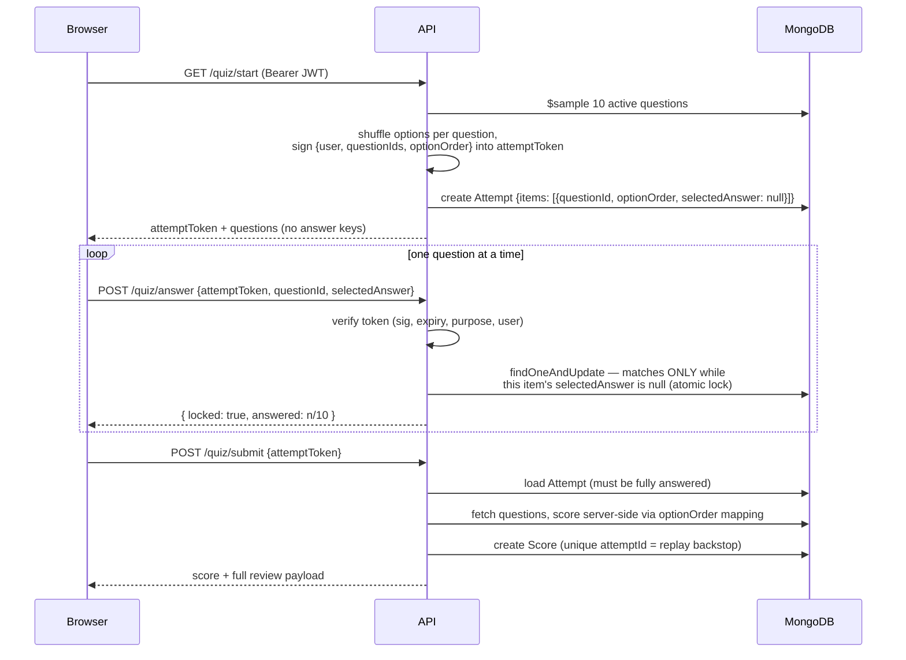

# Architecture

This document explains how OpenAssess is put together, with a focus on the part that makes it more than a CRUD quiz app: the **exam-integrity engine** — the set of server-side mechanisms that make a submitted score trustworthy even against a hostile client.

## System overview



| Layer | Choice | Notes |
|---|---|---|
| Frontend | React 18 + Vite, TypeScript | Context + `useReducer` for quiz state; route-level code splitting |
| API | Express 4, TypeScript | Consistent `{ success, data } / { success, error }` envelopes on every route |
| Data | MongoDB + Mongoose 8 | Indexes support the leaderboard aggregation and per-user history |
| Auth | JWT (HS256, pinned), bcrypt | Secret strength enforced at boot; tokens carry a `purpose` claim |
| Delivery | Docker Compose | nginx serves the built SPA and proxies `/api`; Mongo stays on the internal network |

## The exam-integrity engine

### Threat model

Assume the player fully controls their browser: they can read every response, replay or forge requests, and run scripts. The following attacks must all fail **server-side** — client-side guards are UX, not security.

| # | Attack | Countermeasure | Where |
|---|---|---|---|
| 1 | Read the answer key before answering | Correct answers never leave the server before submission; the start payload is stripped to public fields | `quiz.controller` (`toStartQuizPayload`) |
| 2 | Change an answer after seeing a later question | **Per-question atomic lock**: an answer row can only be written while it is still `null` | `quiz.controller` (`answerQuestion`) + `Attempt` model |
| 3 | Answer out of order / skip ahead | Sequential enforcement: only the earliest unanswered question is accepted | `quiz.controller` (`answerQuestion`) |
| 4 | Submit a different (easier) question set | The signed attempt token pins the exact question IDs; answers for anything else are rejected | `utils/quizAttemptToken` |
| 5 | Re-shuffle options to game the mapping | The per-attempt option order is signed into the token and stored server-side; scoring maps the displayed index back through it | `utils/shuffleQuestion` + `Attempt.items[].optionOrder` |
| 6 | Replay a finished attempt for a better score | Pre-check plus a **unique index on `attemptId`** (the race-safe backstop) | `Score` model |
| 7 | Submit someone else's attempt | The token binds `userId`; verification rejects any other bearer | `utils/quizAttemptToken` |
| 8 | Use a quiz-attempt token as a login token | Session middleware rejects any token carrying a `purpose` claim | `middleware/auth.middleware` |
| 9 | Compute the score client-side | The final score is derived only from server-locked answers vs. the DB answer key | `quiz.controller` (`submitQuiz`) |

### Attempt lifecycle



Two design points worth calling out:

**Hybrid stateless/stateful attempts.** The signed token makes the *contract* of the attempt (who, which questions, which option order, until when) tamper-proof without a DB read, while the `Attempt` document holds the *mutable* state (which answers are locked). Verification is cheap and the mutable surface is minimal — the only thing a client can ever change is writing each `selectedAnswer` exactly once.

**The lock is a conditional update, not application logic.** "Answered exactly once" is enforced by MongoDB's atomicity:

```js
Attempt.findOneAndUpdate(
  { attemptId, userId, status: 'active',
    items: { $elemMatch: { questionId, selectedAnswer: null } } },
  { $set: { 'items.$.selectedAnswer': selected, 'items.$.answeredAt': new Date() } },
)
```

Two racing requests for the same question cannot both match `selectedAnswer: null`, so the second one loses regardless of timing. The same pattern backs replay protection at submit: the controller pre-check is advisory, the unique `attemptId` index is the guarantee.

### Option-order shuffling

Each attempt shuffles every question's options with a Fisher–Yates permutation. The permutation — not the shuffled text — is what gets signed and stored, so:

- the client only ever sees and reports *displayed* index