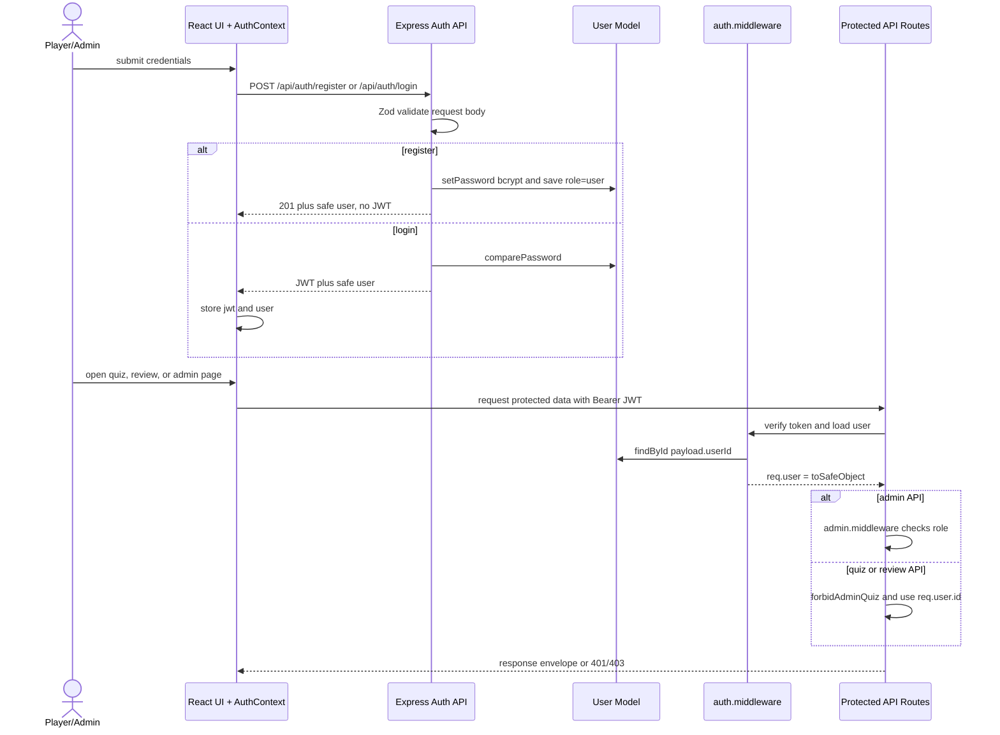

# Individual Contribution Reflection — Tracy Cui

**Student:** Tracy Cui · `ycui0519@uni.sydney.edu.au` · COMP5347 A2 (Group 5)  
**Subsystem:** Authentication & Security — User model, JWT, role-based access, login/register UI  
**Approved variation:** Review Mode after completion  
**Repository:** <https://github.sydney.edu.au/wege8390/COMP4347-COMP5347-Assignment-2--Group5>

## 1. Subsystem Responsibility and Implementation

My main work was the authentication and security slice. On the **backend** (`backend/src/`):

- `models/User.js` — Mongoose schema with `username`, `email`, `passwordHash`, a `role` field that is either `user` or `admin`, and timestamps; instance methods `setPassword` (bcrypt with `BCRYPT_ROUNDS`), `comparePassword`, and `toSafeObject` so `passwordHash` never leaves the server.
- `controllers/auth.controller.js` — three handlers. `register` checks duplicate username/email (409), forces `role: 'user'` so the JSON body cannot escalate. `login` issues a 2-hour JWT carrying `{ userId, role }`. `me` returns whatever the middleware attached to `req.user`.
- `middleware/auth.middleware.js` — Bearer-token parser, signature/expiry verification with distinct messages (`Token expired` vs `Invalid token`), `User.findById`, then `req.user = user.toSafeObject()`.
- `middleware/admin.middleware.js` — returns 403 if `req.user?.role !== 'admin'`. Consumed by Allen's admin routes.
- `validators/auth.validators.js` — Zod schemas: username pattern `[a-zA-Z0-9_-]+` length 3–30, lowercased email, password 8–72 chars (72 is bcrypt's input cap).
- `routes/auth.routes.js` — `loginLimiter` and `registerLimiter` wrapped around the controllers, plus the Swagger JSDoc that drives `/api-docs`.

On the **frontend** (`frontend/src/`):

- `contexts/AuthContext.jsx` — `login` / `register` / `logout` callbacks, `localStorage` persistence for `jwt` + safe `user`, and a `useEffect` that calls `/api/auth/me` on mount to restore (or clear) the session.
- `components/LoginFormPanel.jsx` + `Login.jsx` — React Hook Form + Zod, plus an `adminMode` prop that lets the admin sign-in page reuse the same form.
- `components/Register.jsx` — RHF + Zod, including a `confirmPassword` `.refine` check, then redirect to `/login` with a success notice (no auto-login).
- `components/ProtectedRoute.jsx` — token + role gate, defensive `JSON.parse` for `localStorage`.

I also wrote the auth-related Jest + Supertest cases (register success/duplicate, login success/wrong-password, `/me` with/without token, admin middleware accept/reject), which were later folded into the integrated backend test suite.

## 2. Major Technical Challenge — keeping admin and player roles from blurring into each other

The hardest bug area in my part of the project was the **admin/player role boundary**. Three real failure modes appeared during the integration week, and I had to fix all of them before the role split actually held up.

**Problem A — a player could sign in through the admin form.** Admin sign-in lives at `/bosscoming`, but it posts to the same `/api/auth/login` endpoint. A valid player credential returned a 200 plus a real JWT, so the user was half-logged-in as a player inside what was supposed to be the admin shell. Backend enforcement (403 on `/admin/*`) made the routes safe, but the client UI was confusing. Fix in `LoginFormPanel.jsx` (commit [`14f5a92`](https://github.sydney.edu.au/wege8390/COMP4347-COMP5347-Assignment-2--Group5/commit/14f5a92)):

```js
const signedInUser = await login(username, password);
if (adminMode && signedInUser.role !== 'admin') {
  logout();                 // clear the player token I just stored
  setServerError('This account is not an administrator.');
  return;
}
```

**Problem B — corrupted `localStorage` crashed `ProtectedRoute`.** If `user` in storage was anything other than valid JSON (a half-finished logout, a manual edit during testing), the route's `JSON.parse` threw and the entire protected tree blanked out. Fix in `ProtectedRoute.jsx` (commit [`be281ed`](https://github.sydney.edu.au/wege8390/COMP4347-COMP5347-Assignment-2--Group5/commit/be281ed)):

```js
function readStoredUser() {
  try { return JSON.parse(localStorage.getItem('user') || 'null'); }
  catch { return null; }
}
```

**Problem C — `/me` and `/login` disagreed on the user shape.** Early on, `/login` returned the full safe user but `/me` returned just `{ userId, role }` decoded from the JWT. The frontend stored one shape and then the next session restore overwrote it with a poorer shape, breaking the avatar/role pill in the navbar. I refactored the auth middleware to re-fetch the user and attach `toSafeObject()` (commit [`60ff92e`](https://github.sydney.edu.au/wege8390/COMP4347-COMP5347-Assignment-2--Group5/commit/60ff92e)), then simplified `/me` to just return `req.user` (commit [`f4e5f91`](https://github.sydney.edu.au/wege8390/COMP4347-COMP5347-Assignment-2--Group5/commit/f4e5f91)). Both endpoints now emit the same shape, and Raven's quiz controller and Allen's admin controller could read `req.user.id` without caring which endpoint had populated it.

A secondary fix tied into Tom's rate limiter: when `keyGenerator` used `req.user?.id`, the values were Mongo ObjectIds (objects), not strings, so the limiter's key map was missing hits. I stringified the id inside `toSafeObject` (commit [`de3e282`](https://github.sydney.edu.au/wege8390/COMP4347-COMP5347-Assignment-2--Group5/commit/de3e282)) — small change, but it was a Pair 1 contract slip we caught only because Tom and I were reviewing each other's middleware.

## 3. Mermaid Sequence Diagram — Auth Subsystem



## 4. Git Commit History (15 meaningful commits)

The 15 commits below trace the auth slice from the initial dependencies through the final integration fixes.

| # | Commit | Layer | What it added and why it mattered |
|---|---|---|---|
| 1 | [`32c5bb1`](https://github.sydney.edu.au/wege8390/COMP4347-COMP5347-Assignment-2--Group5/commit/32c5bb1) | backend deps | Added `bcryptjs`, `jsonwebtoken`, `express-rate-limit` — foundation of the auth stack. |
| 2 | [`67d5b87`](https://github.sydney.edu.au/wege8390/COMP4347-COMP5347-Assignment-2--Group5/commit/67d5b87) | model | `User` Mongoose schema with `role: enum ['user', 'admin']` and timestamps. |
| 3 | [`e511754`](https://github.sydney.edu.au/wege8390/COMP4347-COMP5347-Assignment-2--Group5/commit/e511754) | model | `setPassword` / `comparePassword` via bcrypt so plaintext never reaches the DB. |
| 4 | [`b85e9b6`](https://github.sydney.edu.au/wege8390/COMP4347-COMP5347-Assignment-2--Group5/commit/b85e9b6) | model | Added `email` field + `setPassword` instance method (used by register controller). |
| 5 | [`c30c4c1`](https://github.sydney.edu.au/wege8390/COMP4347-COMP5347-Assignment-2--Group5/commit/c30c4c1) | validator | Zod `registerSchema` / `loginSchema` + `validate()` middleware — body validation before any DB hit. |
| 6 | [`dac2108`](https://github.sydney.edu.au/wege8390/COMP4347-COMP5347-Assignment-2--Group5/commit/dac2108) | validator | Tightened register validator: required email, password 8–72 (bcrypt cap), username regex. |
| 7 | [`763d25b`](https://github.sydney.edu.au/wege8390/COMP4347-COMP5347-Assignment-2--Group5/commit/763d25b) | controller | `register` handler with 409 on duplicate username or email. |
| 8 | [`64f901e`](https://github.sydney.edu.au/wege8390/COMP4347-COMP5347-Assignment-2--Group5/commit/64f901e) | controller | `login` handler with `signToken({ userId, role })` and 2h expiry. |
| 9 | [`b57395f`](https://github.sydney.edu.au/wege8390/COMP4347-COMP5347-Assignment-2--Group5/commit/b57395f) | middleware | Bearer-token verification with distinct `Token expired` vs `Invalid token` messages. |
| 10 | [`0801f4f`](https://github.sydney.edu.au/wege8390/COMP4347-COMP5347-Assignment-2--Group5/commit/0801f4f) | controller | Forced `role='user'` on public register — prevents admin escalation through JSON body. |
| 11 | [`1642971`](https://github.sydney.edu.au/wege8390/COMP4347-COMP5347-Assignment-2--Group5/commit/1642971) | routes | Wired auth routes + `loginLimiter` (5/min) + `registerLimiter` + Swagger JSDoc. |
| 12 | [`60ff92e`](https://github.sydney.edu.au/wege8390/COMP4347-COMP5347-Assignment-2--Group5/commit/60ff92e) | middleware | Middleware attaches `toSafeObject()` so `/me` and `/login` agree on user shape (see §2 Problem C). |
| 13 | [`14f5a92`](https://github.sydney.edu.au/wege8390/COMP4347-COMP5347-Assignment-2--Group5/commit/14f5a92) | frontend | Logged out a player who signed in via the admin form (see §2 Problem A). |
| 14 | [`be281ed`](https://github.sydney.edu.au/wege8390/COMP4347-COMP5347-Assignment-2--Group5/commit/be281ed) | frontend | Guarded `ProtectedRoute` against corrupted `localStorage` user JSON (see §2 Problem B). |
| 15 | [`4a576ea`](https://github.sydney.edu.au/wege8390/COMP4347-COMP5347-Assignment-2--Group5/commit/4a576ea) | frontend | Restored session via `/api/auth/me` on mount in `AuthContext` — the recovery contract Raven's history page relies on. |

## 5. Reflection on Review Mode Design Decisions

Review Mode (Raven's frontend, Allen's `Question.explanation` field) only works if a quiz attempt is reliably tied to one identity. That shaped three auth choices below.

1. **`Score.userId` must be a verified ObjectId, not a client claim.** JWT signature verification rejects modified payloads, and I made the auth middleware re-fetch the User document on every protected request before attaching `toSafeObject()` to `req.user` (commit `60ff92e`). Raven's quiz controller reads `req.user.id`, so attempts are bound to the verified current user rather than to a client-supplied field.

2. **Admin viewing a player's review must be deliberate, not a side effect of being logged in.** Admin routes and player routes share the same JWT and the same auth middleware, but the player quiz/review routes are wrapped in `forbidAdminQuiz.middleware` (Tom's), and admin question routes in my `admin.middleware`. This was the Pair 1 contract Tom and I agreed on: one role, one route family, no cross-traffic. So Review Mode shows only the signed-in player's own answers.

3. **No silent admin promotion.** Public `register` always creates `role='user'` (commit `0801f4f`); the only path to admin is the seed script. Keeping the attack surface this small meant I could cover role correctness with a handful of tests, instead of chasing request-body edge cases the week before submission.

If I had more time I would add a refresh-token pair (the 2-hour JWT works for a 2-week project, but not for longer sessions) and a password-reset flow. For A2, a small stateless auth surface was enough: Review Mode gets a verified user identity for every saved attempt, and I did not have to add features the spec listed as out of scope.
