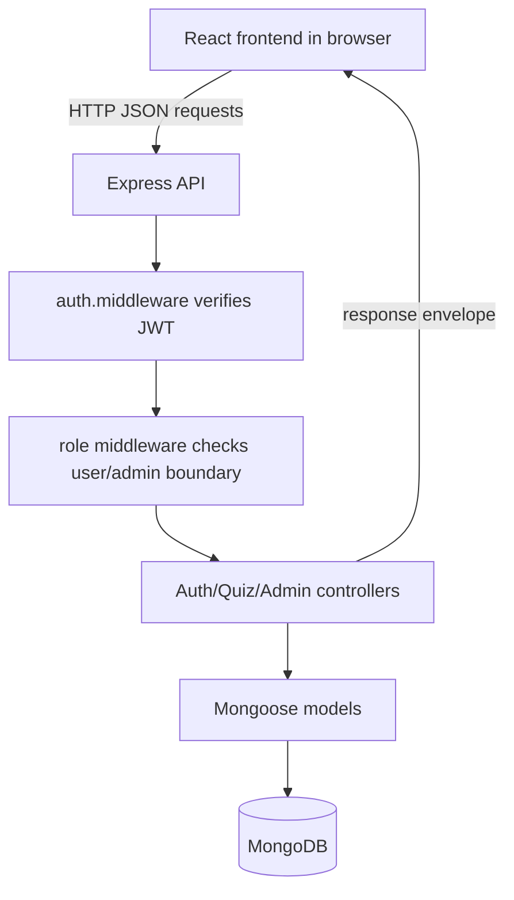
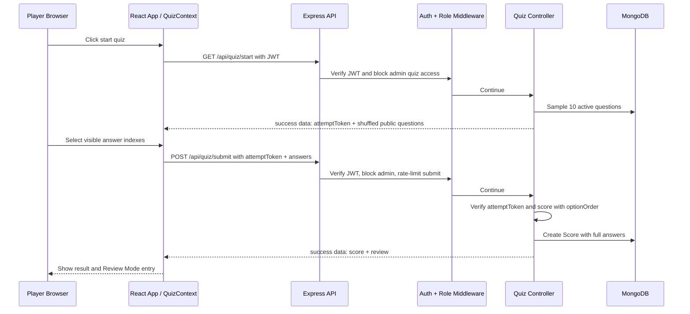

# COMP5347/COMP4347 A2 项目全景与 Role D 口试准备指南

> 读者定位：这份文档假设你不是很熟悉 Web 开发、MERN、JWT、API、数据库、测试这些概念。它会先用白话解释项目在做什么，再逐层解释代码怎么工作，最后专门整理 Tom Tian / Role D 在口试中应该怎样回答 Tutor 的问题。

> 重要边界：这份文档是学习和口试准备材料，不是新的功能说明书。真实实现以当前仓库代码、README、Swagger/Postman、测试为准。

> 本次校对依据：先以 `docs/assignment/A2_Specification.md` 和 `docs/assignment/A2_Ed_Discussion_Supplement.md` 为课程规则，再用 `docs/assignment/A2_Group_Playbook_v3.0.md`、`docs/rubric-assessment.md`、`docs/final-rubric-session-review.md`、`README.md` 和当前代码核对实现。简单说：**作业要求决定必须做什么，当前代码决定现在真的做了什么，这份指南只负责帮你讲明白。**

---

## 0. 先给你一个总答案

这个项目是一个 **MERN 单人答题游戏系统**。

它让普通用户注册、登录、开始一次 10 题测验、提交答案、查看分数、进入 Review Mode 复盘每一道题，还能查看自己的历史记录和全局排行榜。管理员可以登录后台管理题库，包括新增、编辑、删除、启用/停用题目，以及批量导入题目。

项目的技术栈是：

- **MongoDB**：数据库，保存用户、题目、成绩。
- **Express + Node.js**：后端服务器，提供 API。
- **React + Vite**：前端网页应用，用户真正看到和点击的界面。
- **JWT**：登录后的身份令牌，用来证明“这个请求是谁发的”。
- **Mongoose**：Node.js 操作 MongoDB 的工具。
- **Jest/Supertest/Vitest/React Testing Library**：测试工具。
- **Swagger/Postman**：API 文档和接口验证工具。

项目批准的 variation 是 **Review Mode after completion**。意思是：用户答完题之后，可以看到自己每题选了什么、正确答案是什么、是否答对，以及解释。这个项目没有实现赛前分类选择、计时题、多人对战、图片题或自适应题目。

如果你完全没有 Web 背景，先用这个比喻理解：

```text
浏览器前端 = 餐厅前台，负责给客人看菜单、收选择、展示结果
后端 API = 厨房窗口，负责接单、检查身份、按规则处理
数据库 = 仓库账本，长期保存用户、题目、成绩
JWT = 临时通行证，证明“这个人刚刚登录过”
Review Mode = 吃完后给你一张明细账，告诉你每道题选了什么、哪里错了
Role D = 店长/质检员，确保前台、厨房、仓库说的是同一种话
```

最短阅读路线：

1. 先读第 0、1、2 节，知道项目和分工。
2. 再读第 3.4 到 3.7 节，知道前端、后端、API 怎么连起来。
3. 然后读第 5、10、11、12 节，理解 quiz 和 Review Mode 的核心。
4. 最后读第 18、19、26、28 节，准备口试回答。

---

## 1. 你可以怎样向 Tutor 用 30 秒介绍项目

可以直接背这个版本：

> Our project is a MERN single-player quiz game called Sydney Survival. A player can register, sign in, start a 10-question quiz, answer one question at a time, submit the attempt, see the score, and then use the approved Review Mode to inspect every answer with explanations. Admin users have a separate protected question-bank interface for CRUD, active toggling, and bulk import. The backend uses JWT authentication, role-based middleware, Mongoose models, signed attempt tokens for quiz integrity, and a shared response envelope. My Role D contribution focused on integration, robustness, shared API contracts, validation, error handling, theme/app-shell integration, API documentation, tests, and final verification across the other subsystems.

中文理解：

- “这是一个全栈问答游戏。”
- “玩家端负责做题和复盘。”
- “管理员端负责题库。”
- “后端负责身份、权限、题目抽取、计分、保存成绩。”
- “D 的重点不是单独做一个业务功能，而是让 A/B/C 的功能能作为一个完整系统稳定地工作。”

---

## 2. 项目角色划分

README 里列出的团队分工是：

| 成员 | 主要负责 |
|---|---|
| Tracy Cui / Role A | Authentication, JWT, role checks, login/register UI |
| Raven Ge / Role B | Quiz flow, scoring, Review Mode, history, leaderboard |
| Allen Ji / Role C | Admin question CRUD, active toggle, bulk import |
| Tom Tian / Role D | Integration, response envelope, validation, theme, docs, tests |

口试时你最需要记住的是：

- **A = 用户身份系统**：注册、登录、JWT、角色检查、登录/注册 UI。
- **B = 玩家答题系统**：开始测验、答题流程、计分、Review Mode、历史记录、排行榜数据。
- **C = 管理员题库系统**：管理员题目增删改查、启用/停用、批量导入。
- **D = 集成和稳健性系统**：把前面三个子系统串起来，统一接口格式，补齐共享校验和错误处理，写 API 文档和测试，做主题/壳层/路由集成，以及提交前验证。

### D 不应该过度声称什么

如果 Tutor 问 “你是不是做了整个 Review Mode / 整个 Auth / 整个 Admin？” 不要说是。

更安全、更真实的回答是：

> I did not primarily own the business logic for Auth, Quiz Core, Leaderboard, or Admin CRUD. Those were owned by Roles A, B, and C. My Role D work made those independently developed areas integrate consistently through shared Express app wiring, response envelopes, validation/error handling, route guards, frontend API handling, theme/app shell behavior, API documentation, and regression tests. I also fixed integration drift when contracts between frontend, backend, tests, and documentation did not match.

---

## 3. 先理解 Web 项目的基本概念

如果你是计算机小白，先不用急着看代码。先理解下面几个词。

### 3.1 前端是什么

前端就是用户浏览器里看到的页面。

本项目的前端在：

```text
frontend/src/
```

用户看到的页面包括：

- `/quiz`：玩家测验入口和测验页面。
- `/login`：普通用户登录。
- `/register`：普通用户注册。
- `/history`：历史答题记录。
- `/history/:attemptId`：某一次答题的 Review Mode 复盘页面。
- `/leaderboard`：排行榜。
- `/admin/login` 和 `/bosscoming`：管理员登录入口。
- `/admin`：管理员题库页面。

前端使用 React。React 可以理解为“把页面拆成很多组件，然后根据状态自动更新画面”的工具。

### 3.2 后端是什么

后端就是浏览器背后的服务器。它不负责漂亮界面，而是负责：

- 接收前端请求。
- 验证用户身份。
- 判断用户有没有权限。
- 从数据库取数据。
- 写入数据库。
- 返回 JSON 数据。

本项目的后端在：

```text
backend/src/
```

后端使用 Express。Express 可以理解为“Node.js 里写 API 路由的框架”。

### 3.3 数据库是什么

数据库是长期保存数据的地方。

本项目使用 MongoDB，里面主要保存三种东西：

- 用户：`User`
- 题目：`Question`
- 成绩/答题记录：`Score`

如果没有数据库，用户刷新网页以后注册信息、题目、历史成绩都会丢失。

### 3.4 API 是什么

API 可以理解为前端和后端之间的“点菜窗口”。

例如：

- 前端说：“我要登录。” 后端路由是 `POST /api/auth/login`。
- 前端说：“我要开始测验。” 后端路由是 `GET /api/quiz/start`。
- 前端说：“我要提交答案。” 后端路由是 `POST /api/quiz/submit`。
- 管理员说：“我要创建题目。” 后端路由是 `POST /api/admin/questions`。

前端不会直接读数据库，它只能通过 API 向后端要数据。

### 3.5 JWT 是什么

JWT 是 JSON Web Token，可以理解为“登录成功后服务器发给浏览器的一张临时通行证”。

更准确地说，JWT 通常是**签名的 token**，不是“加密保险箱”。签名的意思是：后端能检查这张通行证有没有被改过。不要把 JWT 说成“密码加密”，密码安全靠的是 bcrypt hash。

登录流程大概是：

1. 用户输入用户名和密码。
2. 后端检查密码是否正确。
3. 如果正确，后端生成一个 JWT。
4. 前端把 JWT 放到 `localStorage`。
5. 之后每次访问受保护 API，前端都会在请求头带上：

```text
Authorization: Bearer <token>
```

后端看到 token 后，会验证它是不是真的、有没有过期、对应用户还存不存在。

### 3.6 角色权限是什么

本项目有两种角色：

- `user`：普通玩家。
- `admin`：管理员。

权限规则：

- 普通玩家可以玩 quiz、看 history、看 leaderboard。
- 管理员可以管理题库。
- 管理员不能玩玩家 quiz。
- 普通玩家不能访问 admin 后台。

这个边界在前端和后端都有保护，但真正重要的是后端保护，因为用户可以手动输入 URL 或自己构造请求。

### 3.7 一次网页操作到底发生了什么

对转码初学者来说，最容易混的是“点按钮”和“后端代码运行”之间的关系。

可以把一次操作理解成四步：

1. 用户在浏览器点击按钮，例如点击 `Start Quiz`。
2. React 前端调用 API，例如 `GET /api/quiz/start`。
3. Express 后端收到请求，经过 middleware，再进入 controller。
4. controller 读写 MongoDB，然后返回 JSON 给前端。

所以看代码时，不要只找一个文件。通常要顺着这条线看：

```text
React page/component -> frontend/src/api/api.js -> backend route -> middleware -> controller -> model/database -> response envelope
```

### 3.8 HTTP method 和 status code 是什么

API 路由前面的 `GET`、`POST`、`PUT`、`PATCH`、`DELETE` 是 HTTP method，表示“这次请求大概想做什么”。

本项目里可以这样记：

| Method | 白话意思 | 本项目例子 |
|---|---|---|
| `GET` | 读取数据 | 读取 quiz、history、leaderboard |
| `POST` | 创建或提交数据 | 注册、登录、提交 quiz、批量导入 |
| `PUT` | 整体更新一个资源 | 编辑一道 admin question |
| `PATCH` | 局部修改一个资源 | 切换题目 active/inactive |
| `DELETE` | 删除资源 | 删除一道 question |

HTTP status code 是后端告诉前端“结果类型”的数字：

| Status | 白话意思 | 本项目例子 |
|---|---|---|
| `200` | 成功 | 登录成功、读取成功 |
| `201` | 创建成功 | 注册成功、创建题目成功 |
| `400` | 请求格式不对 | 少答案、题目格式不合法 |
| `401` | 没登录或 token 无效 | 没带 JWT、JWT 过期 |
| `403` | 已登录但没权限 | 普通用户进 admin、admin 玩 quiz |
| `404` | 找不到 | 找不到某次 attempt |
| `409` | 冲突 | 重复提交同一次 quiz、重复题目 |
| `429` | 请求太频繁 | 登录/注册/提交限流 |
| `500` | 服务器内部错误 | 数据库或代码异常 |

D 的 response envelope 不替代 status code。更准确地说：status code 告诉前端“是哪类结果”，envelope 告诉前端“JSON 长什么样”。

### 3.9 JSON 和 response envelope 怎么看

前后端传输的数据通常是 JSON。JSON 可以理解为“前后端都能读懂的对象格式”。

比如登录成功，后端不是返回一整页 HTML，而是返回类似：

```json
{
  "success": true,
  "data": {
    "token": "...",
    "user": {
      "username": "player1",
      "role": "user"
    }
  }
}
```

失败时返回类似：

```json
{
  "success": false,
  "error": "Invalid username or password"
}
```

这就是 response envelope。它让前端知道：成功就读 `data`，失败就读 `error`。

当前实现还可能在这个基础上附加 `statusCode`、`code`、`details`、`meta` 等辅助字段。这些是额外信息，不改变课程要求里的核心格式。口试时抓住主线即可：**必须有 `success`，成功主要看 `data`，失败主要看 `error`。**

### 3.10 localStorage、React state、数据库有什么区别

这三个词都像“存东西”，但层级完全不同：

| 存储位置 | 在哪里 | 刷新页面后还在吗 | 谁能直接访问 | 本项目例子 |
|---|---|---|---|---|
| React state | 浏览器内存 | 通常不在 | 当前 React 页面 | 当前 quiz 第几题、当前选项 |
| `localStorage` | 浏览器本地 | 还在 | 前端 JS | `jwt`、`user`、主题 |
| MongoDB | 后端数据库 | 还在 | 后端通过 Mongoose | 用户、题目、成绩 |

所以：

- 当前正在答第几题，放 React state。
- 登录 token 和主题偏好，放 `localStorage`。
- 用户账号、题库、历史成绩，放 MongoDB。

口试时如果 Tutor 问“刷新后为什么还记得登录”，答案不是“React 记得”，而是：JWT 存在 `localStorage`，启动时 `AuthContext` 再调用 `/api/auth/me` 向后端验证。

### 3.11 前端校验和后端校验为什么都要有

前端校验是为了用户体验。例如注册时马上提示“密码太短”。

后端校验是为了安全和数据正确。例如用户绕过网页，直接用 Postman 或脚本发请求，后端仍然要拒绝坏数据。

本项目的原则是：

- 前端校验让正常用户少犯错。
- 后端校验才是最终可信边界。
- 测试要覆盖后端校验，因为后端是不能被绕过的地方。

这也是 D 可以讲的点：D 不是只做漂亮页面，而是让不同入口进来的请求都有一致的校验、错误格式和测试证据。

### 3.12 React 里的 Context 和状态机是什么

`AuthContext`、`QuizContext`、`ThemeContext` 可以理解为“全局共享状态”。

如果没有 Context，每个页面都要自己保存“当前用户是谁”“当前 quiz 到哪一步”“现在是 light 还是 dark mode”。这样很容易乱。

`QuizContext` 里的 phase 像一个小状态机：

```text
gate -> start -> quiz -> calculating -> result
```

它的意思是：

- `gate`：还没确认用户能不能玩。
- `start`：可以开始，但还没抽题。
- `quiz`：正在答题。
- `calculating`：答完了，正在提交。
- `result`：后端返回分数和 review 后显示结果。

这能帮助你理解为什么有些按钮在某些阶段出现，有些阶段不出现。

### 3.13 环境变量是什么

环境变量就是“不同机器/环境可以不同的配置”，不应该硬编码在代码里。

本项目例子：

- `MONGODB_URI`：数据库地址。
- `JWT_SECRET`：签 JWT 的秘密字符串。
- `CLIENT_ORIGIN`：允许哪个前端访问后端。
- `VITE_API_BASE_URL`：前端应该请求哪个后端 API 地址。

`.env.example` 是模板，真正运行时复制成 `.env`。不要把真实 secret 当成业务逻辑讲，它只是运行配置。

### 3.14 测试为什么分后端和前端

后端测试主要证明 API、权限、计分、数据库保存是对的。比如：

- admin 不能玩 quiz。
- 普通用户不能进 admin。
- 打乱选项后仍然能正确计分。
- 重复提交同一次 attempt 会被拒绝。

前端测试主要证明页面状态和路由保护是对的。比如：

- 未登录访问受保护页面会跳转。
- admin 访问玩家页面会被挡住。
- quiz reducer 能从 `quiz` 进入 `result`。

口试时可以说：手动 demo 只能证明“刚才点通了”，自动测试能证明关键规则可以重复验证。

---

## 4. 仓库结构怎么看

最重要的文件夹：

```text
backend/src/
  app.js
  server.js
  config/
  controllers/
  docs/
  middleware/
  models/
  routes/
  seeds/
  tests/
  utils/
  validators/

frontend/src/
  api/
  components/
  contexts/
  pages/
  styles/
```

如果只想先记住“仓库长什么样”，可以背这个最简 ASCII 图：

```text
COMP5347_A2/
├── package.json                 # 根目录脚本：dev / test / build / demo
├── README.md                    # 项目说明、运行方式、功能和架构
├── scripts/                     # demo 启动/停止辅助脚本
├── docs/                        # 作业要求、Postman、reflection、口试/交付文档
│   ├── assignment/              # A2 specification、Ed clarification、playbook
│   ├── individual-reflections/  # 每个人的 reflection PDF
│   └── project-overview...      # 本文档
│
├── backend/                     # Express + MongoDB API
│   ├── package.json
│   └── src/
│       ├── app.js               # Express app、middleware、route mounting
│       ├── server.js            # 后端启动入口
│       ├── config/              # 数据库、JWT、quiz 常量
│       ├── routes/              # auth / quiz / admin 路由
│       ├── controllers/         # 请求处理和业务逻辑
│       ├── models/              # User / Question / Score
│       ├── middleware/          # auth、admin、rate limit、error handler
│       ├── utils/               # response envelope、attempt token、shuffle
│       ├── validators/          # 请求参数校验
│       ├── seeds/               # demo 数据和导入脚本
│       ├── docs/                # Swagger 配置
│       └── tests/               # 后端 Jest/Supertest 测试
│
└── frontend/                    # Vite + React 前端
    ├── package.json
    ├── index.html
    └── src/
        ├── main.jsx             # React 启动入口
        ├── App.jsx              # 前端路由和 app shell
        ├── api/                 # Axios client、JWT、envelope unwrap
        ├── contexts/            # Auth / Quiz / Theme 全局状态
        ├── pages/               # Quiz / Review / History / Admin 页面
        ├── components/          # 可复用 UI 和功能组件
        │   ├── quiz/            # quiz flow 和 review 组件
        │   ├── navbars/         # public / player / admin 导航
        │   └── __tests__/       # 前端组件测试
        ├── styles/              # 分功能拆分的 CSS
        └── test/                # 前端测试设置
```

记忆方法：

- `backend/src/routes` 决定 URL 入口。
- `backend/src/controllers` 决定 API 做什么。
- `backend/src/models` 决定数据库存什么。
- `frontend/src/App.jsx` 决定前端有哪些页面。
- `frontend/src/api/api.js` 是前端和后端之间的统一连接点。
- `frontend/src/contexts` 保存登录、quiz、主题这些跨页面状态。

### 4.1 后端结构

| 文件夹 | 白话解释 | 例子 |
|---|---|---|
| `routes/` | URL 和处理函数的连接表 | `/api/quiz/start` 交给 `startQuiz` |
| `controllers/` | 真正处理请求的业务逻辑 | 登录、开始测验、提交答案 |
| `models/` | 数据库表结构 | User、Question、Score |
| `middleware/` | 请求进入 controller 前的检查器 | 验证 JWT、检查 admin、错误处理 |
| `utils/` | 可复用小工具 | response envelope、题目选项洗牌、attemptToken |
| `config/` | 共享配置 | quiz 长度、MongoDB 连接、JWT secret |
| `docs/` | API 文档配置 | Swagger |
| `tests/` | 后端测试 | API、错误处理、envelope、admin |
| `seeds/` | demo 数据导入 | 题库、admin/player 账号 |

### 4.2 前端结构

| 文件夹 | 白话解释 | 例子 |
|---|---|---|
| `pages/` | 一个 URL 对应的大页面 | QuizPage、AdminPage、HistoryPage |
| `components/` | 页面里的可复用小块 | LoginFormPanel、Leaderboard、QuestionForm |
| `contexts/` | 全局状态 | AuthContext、QuizContext、ThemeContext |
| `api/` | 前端请求后端的统一工具 | Axios client |
| `styles/` | 样式文件 | 主题、动画、quiz UI |

---

## 5. 用户从打开网页到完成一次测验发生了什么

下面按真实用户流程解释。

### 5.1 用户注册

前端页面：

```text
frontend/src/components/Register.jsx
```

后端路由：

```text
POST /api/auth/register
```

后端 controller：

```text
backend/src/controllers/auth.controller.js
```

数据库模型：

```text
backend/src/models/User.js
```

发生的事情：

1. 用户输入 username、email、password、confirm password。
2. 前端用 Zod 检查格式，例如 username 长度、密码长度、两次密码是否一致。
3. 前端调用 `api.post('/auth/register', ...)`。
4. 后端也用 Zod 检查 username/email/password。
5. 后端把 username/email 转小写和去空格。
6. 后端检查 username 或 email 是否已存在。
7. 后端用 bcrypt 把明文密码变成 `passwordHash`。
8. 后端保存用户，角色固定为 `user`。
9. 后端返回成功 envelope。

重要点：

- 注册时即使请求里偷偷带 `role: 'admin'`，后端也不会让普通用户变成 admin。
- 密码不会明文保存，保存的是 hash。
- 注册成功不会自动登录，需要用户再登录。

### 5.2 用户登录

前端页面：

```text
frontend/src/components/Login.jsx
frontend/src/components/LoginFormPanel.jsx
```

后端路由：

```text
POST /api/auth/login
```

发生的事情：

1. 用户输入 username/password。
2. 前端调用 `/auth/login`。
3. 后端查找对应用户。
4. 后端用 bcrypt 比对密码。
5. 如果正确，后端签发 JWT。
6. 前端把 JWT 存到 `localStorage` 的 `jwt` 键。
7. 前端也把用户信息存到 `localStorage` 的 `user` 键。
8. 前端跳到 `/quiz` 或 `/admin`。

重要点：

- 普通登录页不允许 admin 登录后进入玩家界面。
- 本项目为了边界清楚，前端要求 admin 使用 admin sign-in page。
- 注意：课程要求的核心不是“必须有单独 admin 登录页”，而是 **role-based access control** 必须在前端和后端都生效。本项目选择了单独 admin sign-in 入口作为 UX 和边界保护。
- 如果普通用户试图进 `/admin`，会被前端重定向，后端也会拒绝。

### 5.3 前端恢复登录状态

文件：

```text
frontend/src/contexts/AuthContext.jsx
```

浏览器刷新后，React 状态会丢，但 `localStorage` 还在。

所以 `AuthContext` 会：

1. 看有没有 `jwt`。
2. 如果有，调用：

```text
GET /api/auth/me
```

3. 后端用 `auth.middleware.js` 验证 JWT。
4. 如果 token 有效，返回当前用户。
5. 如果 token 无效或用户不存在，清掉本地登录状态。

这一步对口试很重要。你可以说：

> We do not only trust the user object stored in localStorage. On app load, AuthContext calls `/api/auth/me` to verify the JWT and refresh the safe user object. If verification fails, the stored auth state is cleared.

### 5.4 用户开始测验

前端入口：

```text
frontend/src/pages/QuizPage.jsx
frontend/src/components/quiz/QuizFlow.jsx
frontend/src/contexts/QuizContext.jsx
```

后端路由：

```text
GET /api/quiz/start
```

后端 controller：

```text
backend/src/controllers/quiz.controller.js
```

发生的事情：

1. 前端调用 `/quiz/start`。
2. 请求先经过 `auth.middleware.js`，确认用户已登录。
3. 请求再经过 `forbidAdminQuiz.middleware.js`，确认不是 admin。
4. 后端从 `Question` 里随机抽取 10 道 active 题。
5. 每道题的四个选项会被随机打乱。
6. 后端生成一个 `attemptToken`。
7. 后端返回：

```json
{
  "success": true,
  "data": {
    "attemptToken": "...",
    "questions": [
      {
        "_id": "...",
        "questionText": "...",
        "options": ["...", "...", "...", "..."],
        "topic": "..."
      }
    ]
  }
}
```

注意：

- `/quiz/start` 返回给前端的题目 **不包含 `correctAnswer`**。
- 前端看不到正确答案。
- attemptToken 里签名保存了这次测验的题目 ID 和选项顺序。

### 5.5 用户答题

前端状态文件：

```text
frontend/src/contexts/QuizContext.jsx
```

前端画面文件：

```text
frontend/src/components/quiz/QuizScreens.jsx
```

发生的事情：

1. `QuizContext` 状态从 `gate` 到 `start` 到 `quiz`。
2. 用户每次只看到一道题。
3. 用户点一个选项后，前端锁住当前题。
4. 前端记录：

```js
{
  questionId: q._id,
  sel: selectedIndex
}
```

5. 到第 10 题后，进入 `calculating`。
6. `finishQuiz()` 调用后端 `/quiz/submit`。

重要点：

- 前端有一层防止重复提交：`submitOnceRef`。
- 但真正防重复还要靠后端，因为前端可以被绕过。

### 5.6 用户提交答案

后端路由：

```text
POST /api/quiz/submit
```

请求体大概是：

```json
{
  "attemptToken": "...",
  "answers": [
    {
      "questionId": "...",
      "selectedAnswer": 0
    }
  ]
}
```

后端会做很多检查：

1. 有没有 `attemptToken`。
2. attemptToken 是否有效。
3. attemptToken 是否过期。
4. attemptToken 是否属于当前登录用户。
5. answers 是否是数组。
6. answers 是否刚好 10 个。
7. questionId 是否重复。
8. questionId 是否是合法 Mongo ObjectId。
9. selectedAnswer 是否是 0-3 的整数。
10. 提交的 questionId 集合是否和 attemptToken 里的一致。
11. 这个 attemptId 是否已经提交过。

然后后端计分：

```text
selectedAnswer 是前端看到的“打乱后选项下标”
optionOrder 把它映射回题库原始选项下标
原始选项下标 == question.correctAnswer 时，判定正确
```

保存到 `Score`：

- `userId`
- `attemptId`
- `score`
- `answers`
  - `questionId`
  - `selectedAnswer`
  - `isCorrect`
  - `optionOrder`

最后返回 score 和 review 数据。

### 5.7 Review Mode 是怎样实现的

Review Mode 的关键是：提交后不仅保存一个总分，还保存每一道题的答题详情。

这里要分清“保存了什么”和“复盘时怎么显示”：

- 当前代码在 `Score.answers` 里保存 `questionId`、`selectedAnswer`、`isCorrect`、`optionOrder`。
- 当前代码没有把题干和选项完整复制一份永久 snapshot 到 `Score`。
- 复盘时，后端会用 `questionId` 去 `Question` 里重新查题目内容，再用保存的 `optionOrder` 还原当时的选项顺序。
- 如果题目后来被删除，当前实现会显示 `[Question deleted]`，保证页面不崩溃；更严格的商业产品可以保存完整 snapshot 来保留原题文字。

保存详细答题的原因：

- 用户以后再打开历史记录时，还能看到当时每题选了什么。
- 因为选项顺序是随机的，必须保存 `optionOrder`，否则复盘时选项顺序可能变掉。
- 如果题目后来被删除，Review Mode 至少要显示占位信息，而不是让页面崩溃。

相关后端：

```text
backend/src/models/Score.js
backend/src/controllers/quiz.controller.js
backend/src/utils/shuffleQuestion.js
```

相关前端：

```text
frontend/src/pages/HistoryPage.jsx
frontend/src/pages/ReviewPage.jsx
frontend/src/components/quiz/ReviewQuestionCard.jsx
```

口试可以这样解释：

> Review Mode requires the completed attempt to be reconstructable later. Because options are shuffled per attempt, we store `optionOrder` for each answer. When showing a review, the backend applies the same order again, so the selected answer and correct answer are displayed in the same option order the player originally saw.

---

## 6. 管理员后台做什么

管理员后台页面：

```text
frontend/src/pages/AdminPage.jsx
```

题目表单：

```text
frontend/src/components/QuestionForm.jsx
```

批量导入：

```text
frontend/src/components/BulkImport.jsx
```

后端路由：

```text
backend/src/routes/admin.routes.js
```

后端 controller：

```text
backend/src/controllers/admin.controller.js
```

管理员功能：

- 查看全部题目。
- 新增题目。
- 编辑题目。
- 删除题目。
- 启用/停用题目。
- 批量导入 JSON 题目。
- 分页浏览题库。
- 对删除操作有确认。
- 对题目质量做检查，例如四个选项、正确答案范围、选项不能重复、题干不能是纯符号。

权限保护：

```text
router.use(authMiddleware);
router.use(adminMiddleware);
```

这意味着 admin 路由一开始就要求：

1. 必须登录。
2. 必须是 admin。

如果普通用户直接猜 URL 访问 `/api/admin/questions`，后端返回 403。

---

## 7. 后端三大模型

### 7.1 User

文件：

```text
backend/src/models/User.js
```

保存：

- `username`
- `email`
- `passwordHash`
- `role`
- `createdAt`
- `updatedAt`

方法：

- `setPassword(plain)`：把明文密码 hash 后保存。
- `comparePassword(plain)`：登录时比对密码。
- `toSafeObject()`：返回安全用户对象，不包含 `passwordHash`。

### 7.2 Question

文件：

```text
backend/src/models/Question.js
```

保存：

- `questionText`
- `options`
- `correctAnswer`
- `explanation`
- `topic`
- `active`

重要约束：

- `options` 必须正好 4 个。
- `correctAnswer` 必须是 0 到 3。
- `active` 控制题目是否进入随机抽题池。

### 7.3 Score

文件：

```text
backend/src/models/Score.js
```

保存：

- `userId`
- `score`
- `attemptId`
- `answers`

`answers` 里每一题保存：

- `questionId`
- `selectedAnswer`
- `isCorrect`
- `optionOrder`

重要约束：

- 一次 attempt 必须正好有 10 个 answer。
- `optionOrder` 必须是 0-3 的排列。
- `attemptId` 有唯一索引，防止同一次 attempt 重复提交。

---

## 8. 统一响应格式：Response Envelope

文件：

```text
backend/src/utils/responseEnvelope.js
```

这个文件很短，但对 D 很重要。

成功时：

```json
{
  "success": true,
  "data": {}
}
```

失败时：

```json
{
  "success": false,
  "error": "message"
}
```

为什么需要统一格式？

没有统一格式时，前端每个页面都要猜：

- 成功数据是在 `response.data` 还是 `response.body`？
- 错误信息是 `message` 还是 `error`？
- 有的 API 返回数组，有的 API 返回对象，怎么判断失败？

有统一 envelope 后，前端 API client 可以统一处理。

当前实现可能在失败 envelope 里额外带上 `statusCode`、`code`、`details`，在分页/列表类响应里额外带上 `meta`。这些字段是辅助信息，不替代核心契约。课程要求的主干仍然是：

```text
成功：success + data
失败：success + error
```

前端对应文件：

```text
frontend/src/api/api.js
```

它会做两件事：

1. 请求发出前，如果 `localStorage` 里有 JWT，就自动加上 `Authorization: Bearer ...`。
2. 响应回来后，如果 `success: true`，只把 `data` 交给页面；如果 `success: false`，抛出标准 Error。

口试回答：

> The response envelope is a cross-subsystem contract. Backend controllers return the same success/failure shape, and the frontend Axios interceptor unwraps it consistently. This reduces duplicated error parsing and prevents Auth, Quiz, Admin, and Review pages from each inventing their own response handling.

---

## 9. 统一错误处理：Error Handler

文件：

```text
backend/src/middleware/errorHandler.js
```

它的作用：

- controller 里 `next(err)` 后，统一来到这里。
- 4xx 错误返回可理解的客户端错误。
- 5xx 错误隐藏内部细节，只返回 `Internal server error`。
- 返回格式仍然使用 response envelope。

为什么 5xx 要隐藏内部细节？

如果数据库错误、文件路径、secret 等信息直接返回给用户，可能泄露系统内部信息。口试时可以说：

> For server errors, we avoid exposing internal diagnostic messages to clients. The error handler maps 5xx errors to a generic `Internal server error`, while client-side 4xx errors can keep useful messages such as validation failures.

---

## 10. Attempt Token 是什么，为什么它很重要

文件：

```text
backend/src/utils/quizAttemptToken.js
backend/src/utils/shuffleQuestion.js
backend/src/controllers/quiz.controller.js
backend/src/models/Score.js
```

这是项目稳健性的核心之一。

### 10.1 问题背景

测验开始时：

- 后端随机抽 10 题。
- 每道题选项顺序随机打乱。
- 前端只知道打乱后的选项。

提交时：

- 前端提交的是“我选了第几个可见选项”，例如 0、1、2、3。
- 后端必须知道这个可见选项对应题库里的原始选项。

如果没有 attemptToken，可能出现问题：

- 用户伪造题目 ID。
- 用户把别人的题目拿来提交。
- 用户改掉题目集合。
- 用户重复提交同一次测验。
- Review Mode 无法复原当时的选项顺序。

### 10.2 attemptToken 保存什么

它保存：

- purpose：说明这个 token 是 quiz attempt 用的。
- userId：绑定当前用户。
- attemptId：这次 attempt 的唯一 ID。
- items：
  - qid：题目 ID。
  - order：这道题选项的随机顺序。

token 有有效期：

```text
ATTEMPT_TOKEN_TTL_SECONDS = 2 * 60 * 60
```

即 2 小时。

### 10.3 提交时怎么验证

后端会验证：

- token 签名是否正确。
- token 是否过期。
- token 的 purpose 是否正确。
- token 的 userId 是否等于当前登录用户。
- token 是否包含正好 10 题。
- 每个题目 ID 是否合法。
- 每个 option order 是否是 0-3 的排列。
- 是否有重复题目。

### 10.4 口试高分回答

> The attempt token is a signed, short-lived server-issued contract for one quiz attempt. It binds the attempt to the authenticated user, the exact ten question IDs, and the per-question shuffled option order. On submit, the backend verifies the token before scoring. This prevents tampering, cross-user replay, and question-set mismatch; the `attemptId` inside the token plus the `Score.attemptId` existence check and unique index enforce repeated-submission protection. We also persist `optionOrder` into the Score document so Review Mode can later reconstruct the same answer order.

---

## 11. 选项打乱后怎么判分

这部分很容易被 Tutor 问，因为它能体现你是否真的懂实现。

假设题库原始题目是：

```text
options = ["A", "B", "C", "D"]
correctAnswer = 1
```

说明正确答案是原始选项 `"B"`。

某次测验随机顺序是：

```text
optionOrder = [2, 0, 3, 1]
```

展示给用户的顺序变成：

```text
visible options = ["C", "A", "D", "B"]
```

用户如果选择可见下标 3，也就是 `"B"`，前端提交：

```text
selectedAnswer = 3
```

后端计算：

```text
originalIndex = optionOrder[selectedAnswer]
              = optionOrder[3]
              = 1

originalIndex == correctAnswer
1 == 1
所以正确
```

对应代码逻辑在 `quiz.controller.js`：

```js
const originalIndex = item.order[ans.selectedAnswer];
const isCorrect = originalIndex === question.correctAnswer;
```

口试一句话版本：

> The frontend submits the visible shuffled index. The backend uses `optionOrder` from the signed attempt token to translate that visible index back to the original question-bank index, then compares it with `question.correctAnswer`.

---

## 12. Review Mode 为什么必须保存 optionOrder

如果不保存 `optionOrder`，会出现这种 bug：

1. 用户答题时看到的顺序是 `["C", "A", "D", "B"]`。
2. 用户选的是第 4 个 `"B"`。
3. 以后打开历史复盘时，如果重新打乱成 `["B", "A", "C", "D"]`。
4. 页面可能显示用户选了错误的可见位置。

所以 `Score.answers[i].optionOrder` 是 Review Mode 的关键数据。

口试回答：

> Review Mode is not only about storing score. It needs to reconstruct the exact completed attempt. Since answer options are shuffled per attempt, storing `optionOrder` prevents review pages from drifting away from what the player originally saw.

---

## 13. 路由和权限总结

### 13.1 Auth 路由

| 路由 | 方法 | 作用 | 是否需要登录 |
|---|---|---|---|
| `/api/auth/register` | POST | 注册普通用户 | 否 |
| `/api/auth/login` | POST | 登录并返回 JWT | 否 |
| `/api/auth/me` | GET | 返回当前用户 | 是 |

### 13.2 Quiz 路由

| 路由 | 方法 | 作用 | 权限 |
|---|---|---|---|
| `/api/quiz/start` | GET | 开始一次 10 题测验 | 登录 user，不允许 admin |
| `/api/quiz/submit` | POST | 提交答案并保存成绩 | 登录 user，不允许 admin |
| `/api/quiz/history` | GET | 查看自己的历史 attempt | 登录 user，不允许 admin |
| `/api/quiz/history/:id` | GET | 查看某次 attempt 的 Review Mode | 登录 user，不允许 admin，只能看自己的 |
| `/api/quiz/leaderboard` | GET | 查看排行榜 | 登录 user，不允许 admin |

### 13.3 Admin 路由

| 路由 | 方法 | 作用 | 权限 |
|---|---|---|---|
| `/api/admin/questions` | GET | 获取题库 | admin |
| `/api/admin/questions` | POST | 新增题目 | admin |
| `/api/admin/questions/:id` | PUT | 编辑题目 | admin |
| `/api/admin/questions/:id` | DELETE | 删除题目 | admin |
| `/api/admin/questions/:id/toggle` | PATCH | 启用/停用题目 | admin |
| `/api/admin/questions/bulk-import` | POST | 批量导入题目 | admin |

---

## 14. 前端状态管理

### 14.1 AuthContext

文件：

```text
frontend/src/contexts/AuthContext.jsx
```

负责：

- 当前用户是谁。
- 是否正在验证登录状态。
- 登录。
- 注册。
- 登出。
- 启动时调用 `/auth/me` 验证 JWT。

### 14.2 QuizContext

文件：

```text
frontend/src/contexts/QuizContext.jsx
```

负责 quiz 状态机：

```text
gate -> start -> quiz -> calculating -> result
```

各阶段意思：

- `gate`：访客或未验证状态。
- `start`：已登录，准备开始。
- `quiz`：正在答题。
- `calculating`：答完题，等待提交和结果。
- `result`：显示分数和 Review Mode 入口。

它还负责：

- 保存 `attemptToken`。
- 保存 questions。
- 保存当前题号。
- 保存用户答案。
- 锁定当前题。
- 调用 `/quiz/start`。
- 调用 `/quiz/submit`。
- 处理 401 后登出并回到 gate。

### 14.3 ThemeContext

文件：

```text
frontend/src/contexts/ThemeContext.jsx
```

负责：

- light/dark mode。
- 从 `localStorage` 恢复主题。
- 写入 `document.documentElement.dataset.theme`。
- 支持浏览器 `document.startViewTransition` 时用更平滑的主题切换。

这是 D 的一部分，因为它属于跨页面共享壳层和主题集成，不是单个业务功能。

---

## 15. App.jsx 是怎样把整个应用串起来的

文件：

```text
frontend/src/App.jsx
```

它做几件事：

1. 定义所有前端路由。
2. 决定哪些页面显示导航栏。
3. 根据当前路径选择 player/admin/public navbar。
4. 把 `/history`、`/history/:attemptId`、`/leaderboard` 包在 `ProtectedRoute blockAdmin` 里。
5. 把 `/admin` 包在 `ProtectedAdminRoute` 里。
6. 挂载 `ActiveQuizNavigationGuard`。

### 15.1 ActiveQuizNavigationGuard 是什么

这是一个体验和稳健性功能。

用户正在答题时，如果：

- 刷新网页。
- 按浏览器后退。
- 点击站内其他链接。

系统会弹出确认，提醒用户离开会丢失当前进度。

口试回答：

> The active quiz guard reduces accidental progress loss. It listens to browser unload, back navigation, and internal link clicks while `QuizContext` says there is an active quiz. If the user confirms, we reset the quiz state; otherwise we keep them on the current attempt.

---

## 16. 后端 app.js 是怎样把整个 API 串起来的

文件：

```text
backend/src/app.js
```

它做几件事：

1. 创建 Express app。
2. 加 `helmet()`，提升 HTTP 安全头。
3. 加 CORS，允许前端 origin。
4. 加 JSON body parser，并限制 `1mb`。
5. 加 `express-mongo-sanitize()`，减少 Mongo 注入风险。
6. 提供 `/` 和 `/api/health`。
7. 加 Swagger API 文档。
8. 挂载：

```text
/api/auth  -> authRoutes
/api/quiz  -> quizRoutes
/api/admin -> adminRoutes
```

9. 未匹配路由返回 404 envelope。
10. 最后挂载统一错误处理。

口试回答：

> `app.js` is the backend composition root. It wires global security middleware, JSON parsing, Swagger, route families, the 404 fallback, and the shared error handler. This is a Role D integration file because it makes Auth, Quiz, Admin, docs, and errors behave as one API surface.

---

## 17. D 具体负责哪些文件

从当前代码和 README 证据看，D 主要对应这些类型的文件。

不要把下面的表当成“要背的清单”。对口试来说，更重要的是会用 5 个入口讲清楚 D：

```text
app.js = 后端总装配
responseEnvelope.js = 后端统一说话格式
errorHandler.js = 后端统一处理错误
api.js = 前端统一请求后端
App.jsx = 前端路由和页面壳层
```

其他文件是证据和扩展，不是第一分钟就要全部背出来的内容。

### 17.1 后端集成和稳健性

| 文件 | D 的意义 |
|---|---|
| `backend/src/app.js` | Express app composition、全局中间件、路由挂载、Swagger、404、错误处理 |
| `backend/src/server.js` | 启动服务器和连接数据库 |
| `backend/src/config/db.js` | MongoDB 连接/断开封装 |
| `backend/src/config/quiz.js` | quiz 共享常量，例如 10 题、4 选项、attempt token TTL |
| `backend/src/utils/responseEnvelope.js` | 统一成功/失败响应格式 |
| `backend/src/middleware/errorHandler.js` | 统一错误处理和 5xx 信息隐藏 |
| `backend/src/middleware/rateLimiters.js` | 登录、注册、提交 quiz 的限流响应 |
| `backend/src/utils/quizAttemptToken.js` | attempt token 签名和验证 |
| `backend/src/utils/shuffleQuestion.js` | 选项顺序工具，支持 Review Mode 复原 |
| `backend/src/docs/swagger.js` | API 文档 |
| `backend/src/seeds/seed.js` | demo 数据种子，用于本地演示和 marker 运行 |

### 17.2 前端集成和壳层

| 文件 | D 的意义 |
|---|---|
| `frontend/src/main.jsx` | React root、BrowserRouter、Provider 组合 |
| `frontend/src/App.jsx` | 路由、壳层、导航、active quiz guard |
| `frontend/src/api/api.js` | Axios client、JWT 注入、envelope unwrap |
| `frontend/src/contexts/ThemeContext.jsx` | 全局主题状态 |
| `frontend/src/components/AppShellNavbar.jsx` | 根据路径选择 public/player/admin navbar |
| `frontend/src/components/ProtectedRoute.jsx` | 玩家受保护页面 |
| `frontend/src/components/ProtectedAdminRoute.jsx` | 管理员受保护页面 |

### 17.3 测试和验证

| 文件 | 覆盖重点 |
|---|---|
| `backend/src/tests/api.test.js` | 端到端后端 API、auth、quiz、review、leaderboard、attempt token |
| `backend/src/tests/envelope.test.js` | response envelope |
| `backend/src/tests/errorHandler.test.js` | 错误处理 |
| `backend/src/tests/forbidAdminQuiz.middleware.test.js` | admin 不能玩 quiz |
| `backend/src/tests/validators.test.js` | auth validator |
| `backend/src/tests/admin.controller.test.js` | admin API 验证和批量导入保护 |
| `frontend/src/contexts/__tests__/QuizContext.test.jsx` | quiz reducer 状态转换 |
| `frontend/src/components/__tests__/ProtectedRoute.test.jsx` | 玩家路由保护 |
| `frontend/src/components/__tests__/ProtectedAdminRoute.test.jsx` | admin 路由保护 |
| `frontend/src/components/__tests__/QuestionForm.test.jsx` | 题目表单验证 |
| `frontend/src/components/__tests__/BulkImport.test.jsx` | 批量导入解析 |
| `frontend/src/components/quiz/__tests__/QuizFlow.test.jsx` | quiz 登录 gate 流程 |

---

## 18. D 口试核心叙事

你可以把 D 讲成四个关键词：

```text
Integration -> Contract -> Robustness -> Verification
```

### 18.1 Integration：集成

D 把多个子系统连接起来：

- A 的 auth 和 JWT。
- B 的 quiz/review/history/leaderboard。
- C 的 admin question bank。
- 前端 React routes。
- 后端 Express routes。
- Swagger/Postman 文档。
- 测试。

口试句子：

> My role was integration-focused. I connected the independently owned subsystems into one coherent application, especially through shared routing, shared API handling, route protection, provider composition, and final verification.

### 18.2 Contract：契约

契约就是前后端约定好的格式。

本项目重要契约：

- 成功 response：`{ success: true, data }`
- 失败 response：`{ success: false, error }`
- 登录后：返回 `{ token, user }`
- quiz start：返回 `{ attemptToken, questions }`
- quiz submit：接收 `{ attemptToken, answers }`
- quiz submit：返回 `{ score, total, scoreId, review }`

口试句子：

> A major D responsibility was keeping the API contracts consistent between controllers, frontend API handling, tests, README, Swagger, and Postman.

### 18.3 Robustness：稳健性

稳健性就是系统遇到异常情况不崩、不泄露、不乱存。

本项目例子：

- 没登录不能访问受保护 API。
- 普通用户不能进 admin。
- admin 不能玩 quiz。
- 密码 hash 保存。
- JWT 过期/无效会被拒绝。
- attemptToken 防篡改。
- attemptId 防重复提交。
- 后端验证 10 个答案。
- 后端验证题目 ID 和 selectedAnswer。
- 5xx 错误不暴露内部细节。
- 无 active questions 时返回清楚错误。
- Review Mode 遇到已删除题目不崩溃。

口试句子：

> Robustness was about defending the boundaries between roles and states: authenticated versus unauthenticated, admin versus player, started attempt versus submitted attempt, valid versus tampered request, and safe client error versus internal server error.

### 18.4 Verification：验证

验证就是用测试和构建证明功能真的能工作。

项目里有：

- 后端 Jest + Supertest。
- 前端 Vitest + React Testing Library。
- `npm test --prefix backend`
- `npm test --prefix frontend`
- `npm run build --prefix frontend`
- `git diff --check`
- Swagger/Postman 文档。

口试句子：

> My verification work focused on integration risks: response envelope shape, error handler behavior, auth/admin/player route boundaries, quiz attempt-token integrity, shuffled answer scoring, review payload reconstruction, and frontend protected-route behavior.

---

## 19. Tutor 可能问 D 的问题和推荐回答

### Q1. What exactly was your subsystem?

回答：

> My subsystem was Role D: integration, validation, robustness, shared shell, documentation, and tests. I did not primarily own one business feature like login, quiz scoring, or admin CRUD. Instead, I owned the cross-cutting pieces that made those subsystems work together consistently: Express app wiring, response envelopes, error handling, rate limit responses, API docs, frontend API client, route protection, theme/app shell integration, and regression tests.

### Q2. Why is response envelope important?

回答：

> It gives every API a predictable shape. Success returns `{ success: true, data }`, and failure returns `{ success: false, error }`. The frontend Axios interceptor can unwrap success data and normalize failures once, instead of every page handling API responses differently. It also made tests and API docs easier to align.

### Q3. How does the frontend know the user is logged in?

回答：

> After login, the backend returns a JWT and safe user object. The frontend stores the JWT in `localStorage`. The shared Axios client automatically attaches it as a Bearer token. On app startup, `AuthContext` calls `/api/auth/me` to verify the stored token, refresh the user object, or clear local auth if the token is invalid.

### Q4. How are admin and player routes separated?

回答：

> The backend is the source of truth. Admin APIs use `authMiddleware` followed by `adminMiddleware`, so only users with role `admin` can manage questions. Player quiz APIs use `authMiddleware` followed by `forbidAdminQuiz`, so admins cannot play quiz or view player history/leaderboard. The frontend mirrors this with `ProtectedAdminRoute` and `ProtectedRoute blockAdmin`, but backend enforcement is the real security boundary.

### Q5. Why can’t admin users take quizzes?

回答：

> The project treats admin responsibility as question management, not gameplay. Blocking admins from player quiz routes prevents role confusion and keeps leaderboard/history data focused on players. It is enforced both in backend middleware and frontend route guards.

### Q6. How does scoring work with shuffled options?

回答：

> The frontend submits the visible selected option index. Because options are shuffled, the backend uses the signed `optionOrder` from the attempt token to map that visible index back to the original question-bank option index. Then it compares that original index with `question.correctAnswer`. This ensures scoring matches what the player saw.

### Q7. Why do you need attemptToken?

回答：

> The attempt token binds a quiz attempt to the user, question IDs, and shuffled option orders. It prevents the client from changing the question set, submitting another user's attempt, or scoring against a different option order. Replay protection is completed by checking the token's `attemptId` against existing `Score` records and the unique `Score.attemptId` index. It also supports Review Mode because we later persist the same option order.

### Q8. Is `GET /api/quiz/start` safe if it creates an attempt token?

回答：

> It returns a signed token but does not create a Score document yet. The persistent write happens on submit. For this assignment, it acts as a start/read endpoint that samples questions and returns an attempt contract. A stricter REST design could use `POST /api/quiz/attempts`, but the current implementation avoids storing incomplete attempts and keeps persistence for completed submissions.

### Q9. How does Review Mode work?

回答：

> On submit, the backend stores full answer details in the Score document, not only the total score. Each answer stores questionId, selectedAnswer, isCorrect, and optionOrder. When the user opens a review page, the backend loads that attempt, repopulates question details, reapplies the stored optionOrder, and returns a review payload with selected answer, correct answer, topic, and explanation.

### Q10. What happens if a question is deleted after a user completed a quiz?

回答：

> The review endpoint handles missing populated questions. It returns a placeholder such as `[Question deleted]` instead of crashing. This is an edge-case robustness feature because historical attempts may outlive question-bank entries. The current implementation stores answer details and option order, not a full immutable question snapshot, so a stricter future improvement would be storing the full question text/options/explanation at attempt time.

### Q11. How do you prevent duplicate submissions?

回答：

> There are multiple layers. The frontend has a `submitOnceRef` to prevent double-click or repeated submit in normal UI. The backend checks whether the decoded attemptId already exists before creating Score. The Score model also has a unique index on attemptId. If a duplicate insert still races through, MongoDB duplicate-key error is caught and returned as 409 `Attempt already submitted`.

### Q12. How is error handling centralized?

回答：

> Controllers can call `next(err)`. The shared error handler decides the HTTP status and response message. It returns the same failure envelope and hides internal 5xx details. This keeps error behavior consistent across Auth, Quiz, and Admin routes.

### Q13. What tests did you write or rely on for D?

回答：

> The D-focused tests cover API integration, response envelope helpers, error handler behavior, auth validation, admin/player route boundaries, attempt token behavior, shuffled scoring, history/review reconstruction, leaderboard limits/tie ordering, frontend quiz reducer state, protected routes, admin route guard, question form validation, bulk import parsing, and quiz auth gating.

### Q14. What is your biggest technical challenge?

推荐讲这个：

> The hardest integration challenge was keeping shuffled option order, scoring, saved answers, and Review Mode consistent. The frontend submits a visible option index, but the database stores correctAnswer in original option order. I had to ensure the backend maps visible index back through `optionOrder`, saves the same order in Score, and reconstructs review pages with that order. I also aligned tests so they derive selected answers from the actual start response rather than assuming a fixed option order.

### Q15. If Tutor asks “what would you improve with more time?”

回答：

> I would consider changing quiz start to a more REST-explicit `POST /api/quiz/attempts`, adding stronger API schema generation so Swagger cannot drift from controllers, and adding CI checks that always run backend tests, frontend tests, frontend build, and Postman JSON validation before merge. I would also consider storing incomplete attempts if the product wanted resume-after-refresh, but for this assignment we intentionally store only completed Score records.

---

## 20. 项目运行方式

### 20.1 安装依赖

```bash
npm install
npm run install:all
```

### 20.2 环境变量

后端：

```bash
cp backend/.env.example backend/.env
```

示例：

```env
MONGODB_URI=mongodb://localhost:27017/comp5347_quiz
JWT_SECRET=your_jwt_secret_here
JWT_EXPIRES_IN=2h
BCRYPT_ROUNDS=10
CLIENT_ORIGIN=http://localhost:5173
PORT=5001
```

前端：

```bash
cp frontend/.env.example frontend/.env
```

示例：

```env
VITE_API_BASE_URL=http://localhost:5001/api
```

### 20.3 启动 MongoDB

```bash
docker run -d -p 27017:27017 --name comp5347-quiz-mongo mongo:7
```

### 20.4 导入 demo 数据

```bash
npm run seed --prefix backend
```

会创建：

- admin / AdminPass123
- player1 / PlayerPass123
- player2 / PlayerPass123
- 题库数据

### 20.5 启动前后端

```bash
npm run dev
```

打开：

```text
Frontend: http://localhost:5173
Backend:  http://localhost:5001
Swagger:  http://localhost:5001/api-docs
```

### 20.6 一键 demo

```bash
npm run demo
```

停止 demo MongoDB：

```bash
npm run demo:stop
```

---

## 21. 验证命令

常用检查：

```bash
npm test --prefix backend
npm test --prefix frontend
npm run build --prefix frontend
git diff --check
git status --short
git diff --stat
```

各命令意义：

| 命令 | 检查什么 |
|---|---|
| `npm test --prefix backend` | 后端 API、middleware、model/controller 集成 |
| `npm test --prefix frontend` | React 组件、Context、路由保护 |
| `npm run build --prefix frontend` | 前端能否生产构建 |
| `git diff --check` | 是否有尾随空格等 diff 格式问题 |
| `git status --short` | 工作区是否干净 |
| `git diff --stat` | 改了哪些文件、大概改动量 |

口试中如果 Tutor 问“你怎么知道它能工作”，不要只说“我手动试过”。可以说：

> We used automated tests for backend API and frontend route/state behavior, plus the production frontend build and diff checks. The backend tests are especially important because they verify auth boundaries, response envelopes, attempt token validation, shuffled scoring, review data, admin validation, and leaderboard behavior.

---

## 22. D 贡献证据怎么讲

README 里已经有 Tom 的代表提交，例如：

- `7a61d82`：bootstrap repo layout and project hygiene。
- `972fc77`：integration QA docs and tests。
- `bba8b06`：shuffled-answer API test alignment。
- `d0d07f6`：quiz route error-response documentation。

当前 git history 还显示 Tom/Tom_Tian 有较多提交。口试时不要背一堆 hash，重点讲“提交类型”：

1. 初始仓库结构和脚本。
2. 后端 app foundation。
3. rate limiter。
4. 前端 provider 和 app shell。
5. Swagger API 文档。
6. envelope/error handler 测试。
7. 安全和 API 验证文档。
8. Review Mode / shuffled answer contract 测试修正。
9. admin/player route boundary 修正。
10. final README/API docs/test alignment。

推荐说法：

> My commit history shows an integration role rather than a single isolated feature. Early commits set up the app foundation and shared shell; middle commits added API docs, envelopes, error handling, rate limits, and tests; final commits fixed contract drift around shuffled scoring, route guards, admin/player separation, and README/API documentation.

---

## 23. 常见英文术语速查

| 术语 | 白话解释 |
|---|---|
| Frontend | 浏览器里用户看到的页面 |
| Backend | 服务器，负责 API 和数据库操作 |
| API | 前端向后端请求数据的接口 |
| Route | 某个 URL 对应的处理路径 |
| HTTP method | 请求动作，例如 GET 读取、POST 提交 |
| Status code | HTTP 结果数字，例如 200 成功、401 未登录、403 无权限 |
| JSON | 前后端传输对象数据的文本格式 |
| Controller | 后端处理请求的业务逻辑 |
| Model | 数据库数据结构 |
| Middleware | 请求进入业务逻辑前的检查器 |
| JWT | 登录后的签名身份令牌；证明用户身份，不是密码加密 |
| Bearer token | HTTP Authorization 里携带的 JWT |
| Hash | 单向摘要/哈希；密码保存时用它避免明文存储，不等同于可解密的“加密” |
| React state | 前端页面当前内存状态，刷新后通常会丢 |
| Context | React 跨组件共享状态的机制 |
| localStorage | 浏览器本地小存储，刷新后仍在 |
| Environment variable | 运行配置，例如数据库地址和 JWT secret |
| Mongoose | Node.js 操作 MongoDB 的工具 |
| Response envelope | 统一 API 返回格式 |
| Role-based access control | 基于角色的权限控制 |
| Validation | 校验输入是否合法 |
| Rate limiting | 限制短时间内请求次数 |
| Replay protection | 防止同一个请求/attempt 重复提交 |
| Option order | 一次 quiz 中选项的随机顺序 |
| Review Mode | 答完后复盘每题答案和解释 |
| Regression test | 防止旧 bug 回来的测试 |

---

## 24. 一张系统流程图



注意：这是一张受保护 API 请求的简化图。公开路由例如 `/`、`/api/health`、`POST /api/auth/register`、`POST /api/auth/login` 不需要先经过 auth/role middleware。

中文解释：

- 浏览器发请求。
- Express 收到请求。
- middleware 先检查身份和权限。
- controller 做业务逻辑。
- model 读写 MongoDB。
- controller 用统一 response envelope 返回给浏览器。

---

## 25. 一张 quiz sequence diagram



---

## 26. 口试前 10 分钟速记版

如果你只剩 10 分钟，就记这几段。

### 项目是什么

MERN quiz app. Player can register/login, take 10 random active questions, submit one answer per question, receive score, review every answer in Review Mode, view history and leaderboard. Admin can manage question bank.

### Variation 是什么

Approved variation is Review Mode after completion. It is implemented by storing full answer details in `Score.answers`, including `optionOrder`, then reconstructing review payloads later.

### D 是什么

D is integration, validation, robustness, shared shell, docs, tests. D connects A/Auth, B/Quiz, C/Admin into one stable app.

### D 最重要的代码

- `backend/src/app.js`
- `backend/src/utils/responseEnvelope.js`
- `backend/src/middleware/errorHandler.js`
- `backend/src/middleware/rateLimiters.js`
- `backend/src/utils/quizAttemptToken.js`
- `frontend/src/api/api.js`
- `frontend/src/App.jsx`
- `frontend/src/contexts/ThemeContext.jsx`
- tests under `backend/src/tests/` and `frontend/src/**/__tests__/`

### 最值得讲的技术挑战

Shuffled option order. The frontend submits visible index, backend maps it back to original index using `optionOrder`, scores correctly, stores `optionOrder`, and Review Mode reuses it.

### 最值得讲的稳健性

- JWT auth.
- Admin/user route separation.
- Response envelope.
- Central error handling.
- Attempt token.
- Replay protection.
- Input validation.
- Tests.

---

## 27. 不要在口试中踩的坑

### 不要说“我做了整个项目”

应该说：

> I focused on Role D integration and robustness, while A/B/C owned their respective business features.

### 不要说“前端保护就安全了”

应该说：

> Frontend guards improve UX, but backend middleware is the real security boundary.

### 不要说“Review Mode 只要显示答案就行”

应该说：

> Review Mode needs persisted attempt details and optionOrder so it can reconstruct the exact attempt later.

### 不要说“JWT 是加密密码”

JWT 不是密码加密。JWT 是登录后的 token。密码是 bcrypt hash。

### 不要说“数据库直接给前端”

前端不直接访问数据库。前端通过 API 调后端，后端用 Mongoose 操作数据库。

### 不要说“attemptToken 就是登录 token”

JWT 登录 token 用来证明用户身份。attemptToken 用来证明这一次 quiz attempt 的题目和选项顺序。

---

## 28. 如果 Tutor 让你打开代码讲

推荐打开顺序：

1. `README.md`
   - 讲项目功能、运行方式、角色分工、API、Review Mode。
2. `backend/src/app.js`
   - 讲 D 的集成入口。
3. `backend/src/utils/responseEnvelope.js`
   - 讲统一响应。
4. `frontend/src/api/api.js`
   - 讲前端如何统一处理 envelope 和 JWT。
5. `backend/src/controllers/quiz.controller.js`
   - 讲 attemptToken、optionOrder、提交计分、review payload。
6. `backend/src/models/Score.js`
   - 讲 Review Mode 为什么保存 answers 和 optionOrder。
7. `frontend/src/contexts/QuizContext.jsx`
   - 讲 quiz 状态机。
8. `backend/src/tests/api.test.js`
   - 讲你如何验证 shuffled scoring、token、history、leaderboard。

---

## 29. 最后一段可以背的总结

> This project is not just a set of separate pages. The main engineering challenge was making authentication, quiz attempts, review data, admin question management, frontend routing, API docs, and tests agree on the same contracts. My Role D work focused on those integration contracts: shared response envelopes, centralized error handling, route protection, attempt-token integrity, option-order persistence, frontend API unwrapping, app shell/theme behavior, and regression tests. That is why the app can support the approved Review Mode reliably without exposing answer keys, allowing cross-user submissions, or breaking when routes and data move across frontend and backend layers.
