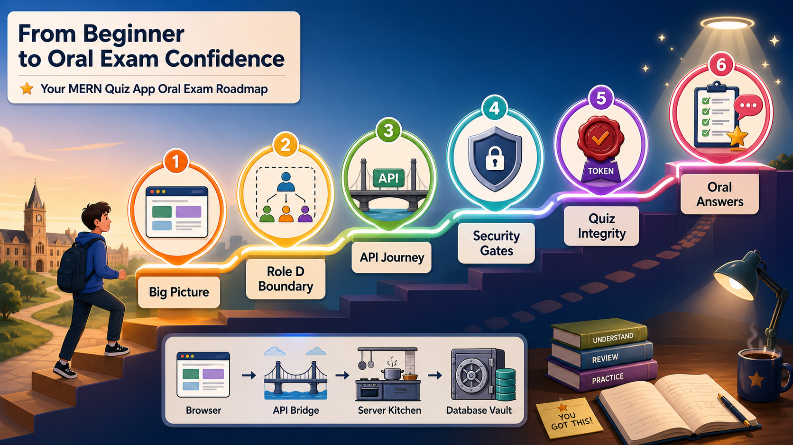
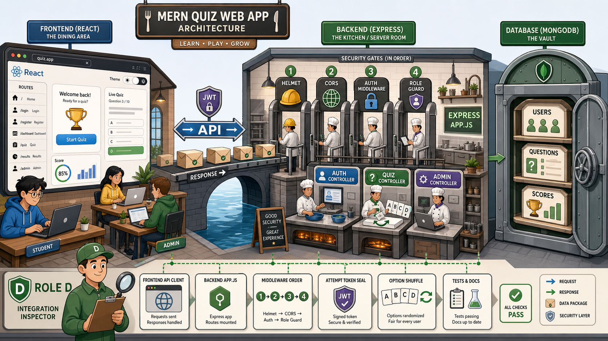
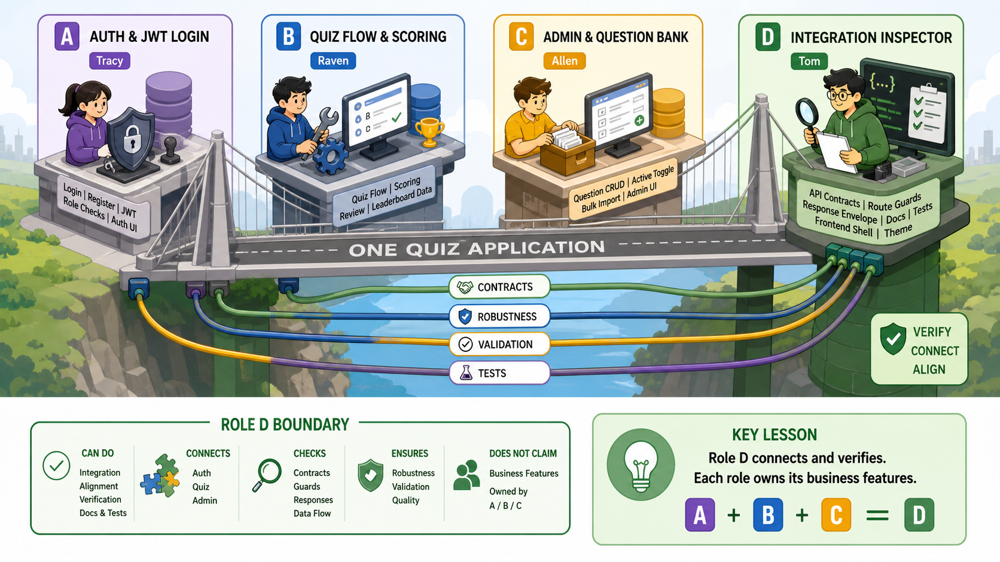
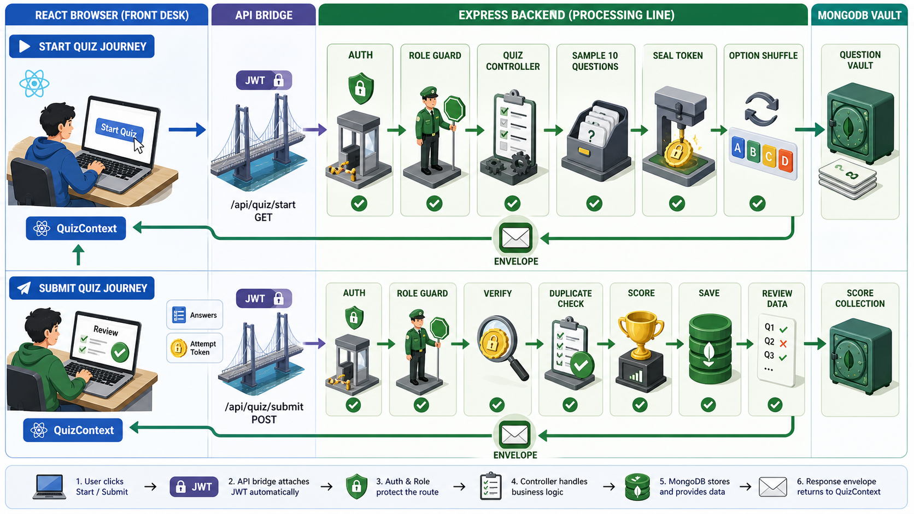
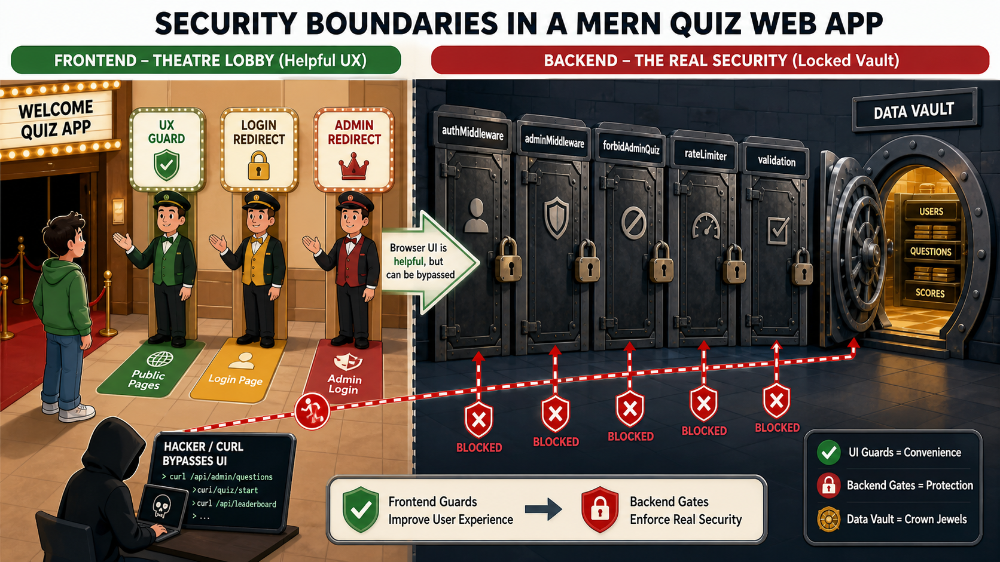
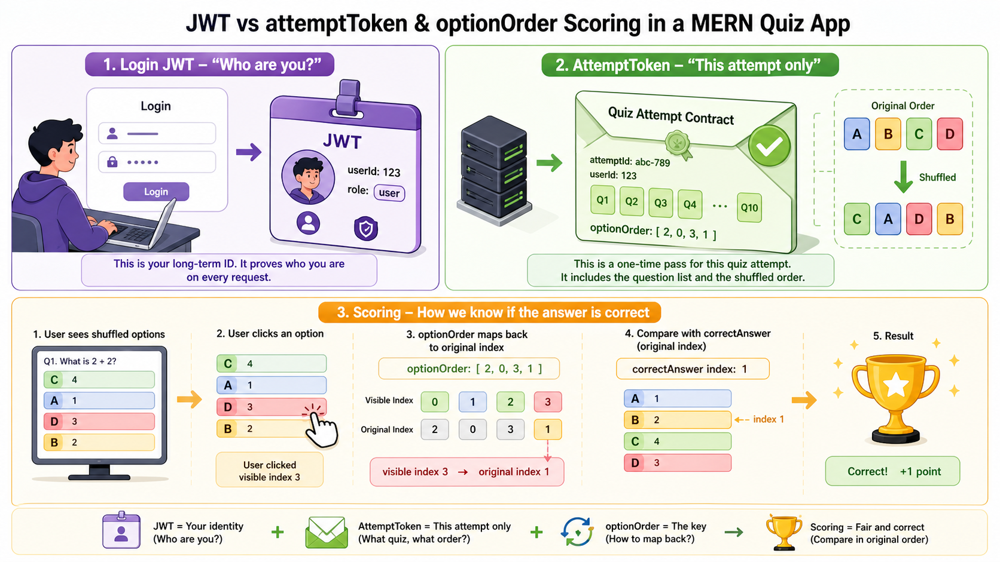
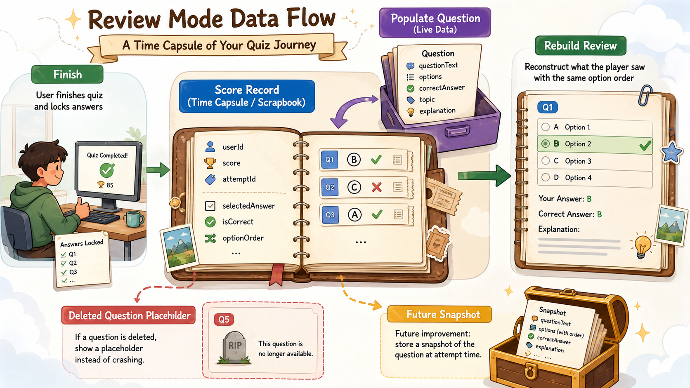

# COMP5347/COMP4347 A2 Role D 口试指南（2 小时版）

> 目标：让你能在 2 小时内抓住口试主线。
> 写法：先讲“大图”，再讲“请求怎么走”，最后讲 tutor 最可能追问的技术细节。
> 记忆原则：不要背完整代码，背清楚 **数据从哪里来、经过谁、被谁检查、最后存到哪里**。

---

## 0. 先看这张总路线图



如果你只有很少时间，按这个顺序准备：

| 时间 | 先看什么 | 目标 |
|---|---|---|
| 20 分钟 | 第 1、2、3、12 章 | 能讲清楚项目、Role D、一次 quiz 请求、背诵版 |
| 60 分钟 | 再看第 4、5、6、9 章 | 能回答 backend design、security、auth、attemptToken |
| 120 分钟 | 全文读完 | 能应对追问、陷阱题、leaderboard/admin 边界 |

### 0.1 最新考情：三题必背

根据最新口试反馈，优先背这三题。它们原本已经分布在第 3、5、6、9、12 章，这里集中成可以直接回答的版本。

#### 题 1：JWT 是什么？项目里怎么用？

老奶奶版：

> JWT 像一张有服务器签名的会员卡。用户登录成功后，服务器发一张卡给前端。以后前端每次请求都带上这张卡，后端先验签名和过期时间，再知道“这个请求是谁发来的”。

项目实现：

1. 登录成功后，`auth.controller.js` 用 `jwt.sign()` 签发 token。
2. token payload 包含 `userId` 和 `role`。
3. 过期时间默认是 `JWT_EXPIRES_IN || '2h'`。
4. secret 来自 `process.env.JWT_SECRET`，test 环境才用测试兜底值。
5. 前端 `api.js` 自动加 `Authorization: Bearer <token>`。
6. 后端 `authMiddleware` 用 `jwt.verify()` 验证 token，再从数据库重新找 user，放到 `req.user`。
7. JWT 只证明身份；真正能不能进 admin/quiz，还要看 role middleware。

英文口试版：

> JWT is used for authentication. After login, the backend signs a token containing the user's ID and role, with a default two-hour expiry. The frontend sends it in the `Authorization: Bearer` header. On protected routes, `authMiddleware` verifies the token, reloads the user from MongoDB, and attaches a safe user object to `req.user`. JWT proves identity, while role middleware handles authorisation.

#### 题 2：Quiz 的核心逻辑是什么？

老奶奶版：

> Quiz 像一次考试。开始时，后端从题库抽 10 道题，把答案藏起来，把选项打乱，再给这次考试贴一个密封标签 `attemptToken`。提交时，后端打开这个密封标签，确认题目没被换、用户没换、选项顺序没乱，然后自己重新算分。

Start Quiz：

1. 前端调用 `GET /api/quiz/start`。
2. 后端先过 `authMiddleware`，确认用户登录。
3. 再过 `forbidAdminQuiz`，阻止 admin 当 player 答题。
4. 从 active questions 里随机抽 10 题。
5. 每题生成 `optionOrder`，打乱选项顺序。
6. 后端签发 `attemptToken`，里面包含 userId、attemptId、10 个 questionId、每题 optionOrder。
7. 后端去掉 `correctAnswer` 和 `explanation`，只把公开题目发给前端。

Submit Quiz：

1. 前端提交 `attemptToken + answers`。
2. 后端验证 token 签名、过期时间、userId、题目 ID、optionOrder。
3. 必须正好提交 10 个答案。
4. 提交的 questionId 必须和 token 里的 10 个完全一致。
5. 如果 `attemptId` 已经提交过，返回 duplicate submission。
6. 后端重新从数据库取题，不能相信前端报分。
7. 用 `originalIndex = optionOrder[selectedAnswer]` 把可见选项位置翻译回数据库原始位置。
8. 后端计算 score，保存 `Score`，返回 score + review data。

英文口试版：

> The quiz core has two phases: start and submit. On start, the backend authenticates the user, blocks admins, samples 10 active questions, shuffles each question's option order, signs an attempt token, strips answer fields, and returns public questions. On submit, the backend verifies the token, checks the submitted question IDs, rejects duplicate attempts, maps selected answers through `optionOrder`, recalculates the score server-side, saves the `Score`, and returns review data.

#### 题 3：如何随机选择题目？

老奶奶版：

> 后端不是把题库按顺序发给用户，而是先只看“启用中的题”，再让 MongoDB 像洗牌一样随机拿 10 道。题目抽完以后，每道题的四个选项还会再单独洗牌。

源码逻辑在 `startQuiz`：

```js
const raw = await Question.aggregate([
  { $match: { active: true } },
  { $sample: { size: QUIZ_LENGTH } },
  {
    $project: {
      questionText: 1,
      options: 1,
      topic: 1,
      correctAnswer: 1,
    },
  },
]);
```

关键点：

1. `QUIZ_LENGTH` 是 10，来自 `backend/src/config/quiz.js`。
2. `$match: { active: true }` 先过滤，只从启用题目里抽。
3. `$sample: { size: QUIZ_LENGTH }` 让 MongoDB 随机抽 10 道。
4. 如果 active 题少于 10 道，返回 400：`Not enough active questions in database`。
5. `$project` 只取后续需要的字段。
6. 抽题随机和选项随机是两件事：`$sample` 随机题目，`generateOptionOrder()` 随机每题选项顺序。

英文口试版：

> Questions are randomly selected in the backend using a MongoDB aggregation pipeline. The controller first filters active questions with `$match`, then uses `$sample` with `QUIZ_LENGTH`, which is 10, to randomly select the quiz questions. If there are fewer than 10 active questions, the backend returns a clear 400 error. After question selection, option order is shuffled separately with `generateOptionOrder()`.

#### 题 4：Token 过期以后怎么处理？

先分清楚两个 token：

| token | 用途 | 过期时间 | 过期后谁处理 |
|---|---|---:|---|
| Login JWT | 证明用户身份 | 默认 2 小时 | `authMiddleware` |
| `attemptToken` | 证明这一次 quiz 的题目和选项顺序 | 2 小时 | `verifyAttemptToken()` + `submitQuiz` |

登录 JWT 过期：

1. 前端仍然会把旧 JWT 放在 `Authorization: Bearer <token>` 里。
2. 后端 `authMiddleware` 调用 `jwt.verify(token, getJwtSecret())`。
3. 如果 jsonwebtoken 抛出 `TokenExpiredError`，后端返回：

```json
{ "success": false, "error": "Token expired" }
```

HTTP status 是 `401`。

4. 前端如果在启动时调用 `/auth/me` 失败，会清掉 localStorage 里的 `jwt` 和 `user`，把用户状态设回未登录。
5. 如果用户正在 start/submit quiz 时遇到 `401`，`QuizContext` 会调用 `logout()`，并提示重新登录。

`attemptToken` 过期：

1. `attemptToken` 在 start quiz 时签发，TTL 是 `ATTEMPT_TOKEN_TTL_SECONDS = 2 * 60 * 60`。
2. submit quiz 时，后端用 `verifyAttemptToken(attemptToken, req.user.id)` 验证。
3. 如果 quiz attempt token 过期，`verifyAttemptToken()` 把错误标成 `expired`。
4. `submitQuiz` 返回：

```json
{ "success": false, "error": "Attempt token expired" }
```

HTTP status 也是 `401`。

5. 过期的 attempt 不会被计分，也不会保存 Score；用户需要重新登录或重新开始一次 quiz。

英文口试版：

> There are two expiry cases. For the login JWT, `authMiddleware` verifies the bearer token. If `jwt.verify` throws `TokenExpiredError`, the backend returns `401` with `{ success: false, error: "Token expired" }`, and the frontend clears stored auth or asks the user to sign in again. For the quiz `attemptToken`, it expires after two hours. On submit, `verifyAttemptToken` maps an expired token to an `expired` error, and `submitQuiz` returns `401` with `"Attempt token expired"`. An expired attempt is rejected and not scored, so the user must start again.

你整场口试最核心的一句话：

> This project is a React + Express + MongoDB quiz system. My Role D work focused on integration: shared API contracts, response envelopes, error handling, route protection, frontend API wiring, documentation, tests, and robustness across Auth, Quiz, Admin, Review, and Leaderboard.

中文意思：

> 这个项目不是几个页面拼起来，而是一套 React 前端、Express 后端、MongoDB 数据库连接起来的 quiz 系统。我的 Role D 重点不是抢 Auth、Quiz、Admin 的主业务，而是把这些模块用统一接口、安全边界、错误处理、路由保护、文档和测试接起来。

---

## 1. 项目到底在做什么

### 1.1 给老奶奶听的版本

你可以把这个项目想成一个“线上考试餐厅”：

- 前端 React：餐厅大厅和点餐屏，用户在这里登录、答题、看成绩。
- 后端 Express：后厨和服务员，负责检查身份、抽题、算分、保存成绩。
- MongoDB：仓库，存用户、题库、成绩记录。
- JWT：会员卡，证明“你是谁”。
- attemptToken：这一次考试的密封试卷袋，证明“你这次拿到的是哪 10 题、每题选项怎么打乱”。
- response envelope：统一回执单，后端每次都用同样格式告诉前端成功或失败。



### 1.2 技术版

系统分三层：

| 层 | 技术 | 做什么 |
|---|---|---|
| Frontend | React + Vite + Axios | 页面、路由、状态、调用 API |
| Backend | Express + Middleware + Controllers + Validators + Models | 鉴权、权限、校验、业务逻辑、统一错误、数据库模型 |
| Database | MongoDB + Mongoose | 存 User、Question、Score |

一次正常请求大概这样走：

```text
React page
  -> frontend/src/api/api.js
  -> Express route
  -> middleware checks
  -> controller
  -> Mongoose model
  -> MongoDB
  -> response envelope
  -> React page
```

### 1.3 口试可直接说

> The frontend is responsible for user interaction and state. The backend is responsible for security, validation, scoring, and persistence. MongoDB stores users, questions, and score attempts. Role D sits across the boundaries: API consistency, route protection, shared response format, error handling, tests, and documentation.

---

## 2. Role D 到底是什么

### 2.1 不要把自己说成全栈全包

README 和 repo ownership 里，团队分工大概是：

| 人 | 角色 | 主责 |
|---|---|---|
| Tracy | Role A | Auth、JWT、role checks、login/register UI |
| Raven | Role B | Quiz flow、scoring、Review Mode、history、leaderboard data |
| Allen | Role C | Admin question CRUD、active toggle、bulk import |
| Tom | Role D | Integration、response envelope、error handling、theme、docs、tests |



你可以说你理解 Auth、Quiz、Admin、Leaderboard，但不要说“全部都是我做的”。更稳的说法是：

> I was not the primary owner of every business feature. My Role D contribution was making the subsystems work together reliably: backend app wiring, shared response envelopes, error handling, route protection, frontend API handling, shared shell/theme, API documentation, tests, and robustness fixes.

### 2.2 你的高价值贡献怎么讲

最稳的贡献画像：

| 领域 | 你可以主讲什么 |
|---|---|
| Backend architecture | `app.js` 组合 Express app、挂 routes、全局 middleware、404、errorHandler |
| API contract | `ok()` / `fail()` response envelope，前端 `api.js` 统一 unwrap |
| Security integration | route middleware 顺序、admin/player 分离、rate limiter、attempt token |
| Frontend integration | `App.jsx` 路由、ProtectedRoute、ProtectedAdminRoute、ThemeContext、API client |
| Quiz robustness | attemptToken、optionOrder、重复提交保护、Review Mode 数据保存 |
| Docs/tests | Swagger/Postman/guide/test coverage/QA evidence |

### 2.3 如果 tutor 问 “你说你做了 leaderboard?”

不要硬说“leaderboard 是我完整实现的”。更安全：

> Leaderboard data logic was mainly Role B. My contribution and understanding are at the integration and access-control level. The route is protected by `authMiddleware` and `forbidAdminQuiz`, the response follows the shared envelope, and the frontend route uses `ProtectedRoute blockAdmin`. I can explain the aggregation: it takes each user's best score, breaks ties by the earliest time that best score was achieved, limits to top 50, and joins user data with `$lookup`.

中文理解：

> leaderboard 核心数据逻辑主要是 Raven 的 Role B。你讲你负责/理解它和系统怎么接起来：权限、路由、返回格式、前端页面保护。然后能解释 aggregation 的大致逻辑即可。

### 2.4 如果 tutor 问 “你说你做了 management panel?”

更稳说法：

> Admin CRUD was mainly Role C. My relevant contribution was around integration, validation hardening, protected admin routes, bulk import protection, frontend polish, and keeping admin API responses consistent with the shared envelope.

---

## 3. 一次 Quiz 请求怎么走

这一章是全指南的主线。你只要能讲清楚它，很多问题都会自动串起来。



### 3.1 Start Quiz：开始答题

用户点 Start Quiz 后，流程是：

```text
React StartScreen
  -> api.get('/quiz/start')
  -> Axios 自动带 Authorization: Bearer <JWT>
  -> backend/src/routes/quiz.routes.js
  -> authMiddleware 检查 JWT
  -> forbidAdminQuiz 阻止 admin 玩 quiz
  -> startQuiz controller
  -> MongoDB 从 active questions 随机抽 10 题
  -> 给每题生成 optionOrder
  -> 签 attemptToken
  -> 去掉 correctAnswer / explanation
  -> 返回 { success: true, data: { attemptToken, questions } }
```

关键点：

- `GET /api/quiz/start` 需要登录用户。
- `authMiddleware` 证明“你是谁”。
- `forbidAdminQuiz` 证明“你不是 admin，admin 不能作为 player 答题”。
- `$sample` 从 active 题里随机抽 10 题。
- `toStartQuizPayload()` 不把正确答案发给前端。
- `attemptToken` 把 userId、attemptId、10 个 questionId、每题 optionOrder 签起来。

英文答法：

> When a player starts a quiz, the frontend calls `GET /api/quiz/start`. The API client attaches the JWT. The backend authenticates the user, blocks admins from player quiz routes, samples 10 active questions, generates shuffled option orders, signs an attempt token, strips server-only fields like correct answers, and returns the public questions through the shared response envelope.

### 3.2 Submit Quiz：提交答案

用户提交后，流程是：

```text
React submit
  -> POST /api/quiz/submit with attemptToken + answers
  -> authMiddleware
  -> forbidAdminQuiz
  -> quizSubmitLimiter
  -> verifyAttemptToken
  -> validate answers length = 10
  -> validate question IDs match token
  -> reject duplicate attemptId if already submitted
  -> fetch real questions from MongoDB
  -> use optionOrder to calculate score
  -> save Score
  -> return score + review data
```

关键点：

- 后端不相信前端给的“对/错”。
- 前端只提交 `selectedAnswer`，也就是用户看到的选项位置。
- 后端用 token 里的 `optionOrder` 把可见位置翻译回数据库原始位置。
- `Score.exists({ attemptId })` 和 unique index 一起防止重复提交。

英文答法：

> On submit, the frontend sends the signed `attemptToken` and the selected answers. The backend verifies the token, checks that the submitted question IDs exactly match the token, rejects duplicate submissions, fetches the original questions, maps the visible answer index through `optionOrder`, calculates the score server-side, saves the `Score` record, and returns review data.

### 3.3 Start 和 Submit 的区别

| 阶段 | 重点 | 防什么 |
|---|---|---|
| Start | 抽题、打乱、签 token、隐藏答案 | 防止前端提前看到答案 |
| Submit | 验 token、验题目、后端算分、保存 Score | 防止改题、改顺序、重复交、自己报分 |

---

## 4. Backend Design：后端架构怎么讲

### 4.1 Express app 是“总装配台”

`backend/src/app.js` 做的事：

```text
helmet()
cors()
express.json({ limit: '1mb' })
mongoSanitize()
root route + health route
setupSwagger(app)
/api/auth
/api/quiz
/api/admin
404 handler
errorHandler
```

你可以把它理解成机场安检：

1. 先戴头盔：`helmet()` 加 HTTP 安全头。
2. 再看允许谁进：CORS 只允许前端 origin。
3. 再限制行李大小：JSON body 1MB。
4. 再清理危险符号：`mongoSanitize()` 防御 Mongo operator injection。
5. 再分流：auth/quiz/admin route families。
6. 最后兜底：找不到路由就 404，未捕获错误交给 errorHandler。

英文答法：

> The backend follows a layered Express structure. `app.js` is the composition root. It applies global middleware such as Helmet, CORS, JSON body parsing, and Mongo sanitisation, then mounts auth, quiz, and admin route families. Routes define middleware order, controllers handle request logic, models persist data, and shared utilities handle response envelopes, error handling, attempt tokens, and rate limits.

### 4.2 Routes / Middleware / Controllers / Models 是什么

| 名字 | 老奶奶版 | 项目里的例子 |
|---|---|---|
| Route | 门牌号：这个 URL 找谁 | `/api/quiz/start` 找 `startQuiz` |
| Middleware | 门卫：进门前检查 | `authMiddleware`, `forbidAdminQuiz` |
| Controller | 办事员：真正处理业务 | 抽题、提交、算分、查 leaderboard |
| Model | 仓库表格 | `User`, `Question`, `Score` |

### 4.3 Middleware 顺序很重要

Quiz route 里最典型：

```js
router.post('/submit', authMiddleware, forbidAdminQuiz, quizSubmitLimiter, submitQuiz);
```

顺序意思：

1. `authMiddleware`：先确认你有合法 JWT。
2. `forbidAdminQuiz`：再确认你不是 admin。
3. `quizSubmitLimiter`：再限制提交频率。
4. `submitQuiz`：最后才处理业务。

英文答法：

> Middleware runs in order. We authenticate first, then enforce role boundaries, then apply rate limiting, and only then call the controller. That keeps business logic behind the security boundary instead of relying on frontend checks.

### 4.4 Response Envelope 是什么

项目里统一用：

```js
ok(data)   -> { success: true, data }
fail(msg)  -> { success: false, error: msg }
```

为什么有用？

- 前端不用每个页面猜后端返回长什么样。
- 成功永远读 `data`。
- 失败永远读 `error`。
- `api.js` 可以在一个地方统一 unwrap response。
- Swagger/Postman/tests 更容易对齐。

英文答法：

> The response envelope is a shared API contract. Successful responses return `{ success: true, data }`, and failures return `{ success: false, error }`. This lets the frontend API client unwrap responses in one place and keeps Auth, Quiz, Admin, Review, documentation, and tests aligned.

### 4.5 HTTP status code 和 envelope 不冲突

很多新手会问：既然 body 里有 `success`，为什么还要 400/401/403？

答案：

- HTTP status 是给浏览器、Axios、Postman、监控工具看的分类。
- envelope 是给前端代码看的统一 body 格式。

例子：

```text
401 + { success: false, error: "Invalid token" }
```

意思是：

- `401`：这类错误属于未认证。
- `error`：前端可以显示具体消息。

---

## 5. Security：安全和权限怎么讲



### 5.1 Authentication vs Authorisation

这是 tutor 很可能问的基础概念。

| 概念 | 中文 | 项目例子 |
|---|---|---|
| Authentication | 认证：你是谁？ | JWT 能证明这个请求属于某个 user |
| Authorisation | 授权：你能做什么？ | admin 才能进 `/api/admin`，admin 不能玩 quiz |

英文答法：

> Authentication answers “who are you?”, and authorisation answers “what are you allowed to do?”. In this project, JWT authentication identifies the user, while role middleware decides whether that user can access admin routes or player quiz routes.

### 5.2 JWT 登录 token 做什么

登录成功后，后端返回 JWT。这个 JWT 里包含：

- `userId`
- `role`
- 过期时间，默认 `JWT_EXPIRES_IN || '2h'`

JWT secret 由 `getJwtSecret()` 读取：正常环境必须从 `process.env.JWT_SECRET` 提供，test 环境才使用测试兜底值。

前端把它存在 localStorage，每次 API 请求由 `api.js` 自动加：

```text
Authorization: Bearer <token>
```

后端 `authMiddleware` 做：

1. 检查 header 有没有 Bearer token。
2. `jwt.verify()` 验签名和过期时间。
3. 从数据库重新找 user。
4. 把安全版 user 放到 `req.user`。

注意：JWT 不是加密密码。密码用 bcrypt hash 存在数据库里。

### 5.3 bcrypt 做什么

`User.setPassword()` 用 bcrypt hash 密码，rounds 默认是 10，也可以由 `BCRYPT_ROUNDS` 环境变量覆盖。

老奶奶版：

> 数据库不存原密码，只存“打碎搅拌后的密码指纹”。登录时把用户输入的密码也做同样处理，再比较是否匹配。

英文答法：

> Passwords are not stored in plain text. The User model hashes passwords with bcrypt and compares login attempts using `bcrypt.compare`. JWT is only issued after the password check succeeds.

### 5.4 前端 route guard 不是最终安全边界

前端 `ProtectedRoute` 和 `ProtectedAdminRoute` 主要是 UX：

- 没登录就别显示 history。
- admin 进 player 页面时跳走。
- player 进 admin 页面时跳走。

但真正安全必须在后端：

- 用户可以绕过前端，直接用 curl/Postman 打 API。
- 所以后端 middleware 必须每次检查 JWT 和 role。

英文答法：

> Frontend route guards improve user experience, but the backend is the real security boundary. A user can bypass React and call APIs directly, so every protected backend route must still verify JWT and role permissions.

### 5.5 `/quiz` 的特殊点：不要说错

当前 `frontend/src/App.jsx` 里：

```jsx
<Route path="/quiz" element={<QuizPage />} />
```

也就是说：`/quiz` 没有直接包 `ProtectedRoute`。

它的实际保护方式是：

| 位置 | 做什么 |
|---|---|
| `QuizFlow` | 如果没登录，显示 gate screen，不直接开始 quiz |
| 后端 `/api/quiz/start` | `authMiddleware` 要求 JWT |
| 后端 `/api/quiz/start` | `forbidAdminQuiz` 阻止 admin |

所以口试中不要说：

> `/quiz` is protected by ProtectedRoute blockAdmin.

正确说：

> `/quiz` is an exception. It is not wrapped by `ProtectedRoute` at the route level. `QuizFlow` handles the guest gate internally, and the backend still enforces the real boundary with `authMiddleware` and `forbidAdminQuiz` on quiz APIs.

### 5.6 Admin 和 Player 为什么要分开

如果 admin 可以自己玩 quiz，会有两个问题：

1. admin 管题库，可能看到/改到答案。
2. admin 的成绩可能污染 player leaderboard。

所以后端用：

- `/api/admin/*`：`authMiddleware` + `adminMiddleware`
- `/api/quiz/*`：`authMiddleware` + `forbidAdminQuiz`

英文答法：

> We separate admin and player responsibilities. Admins manage questions, while users take quizzes. The backend enforces this with `adminMiddleware` for admin APIs and `forbidAdminQuiz` for player quiz APIs, reducing privilege confusion and leaderboard pollution.

### 5.7 Rate Limit 做什么

项目里有三类限流：

| limiter | 默认限制 | 用途 |
|---|---:|---|
| login | 5/min | 减少暴力猜密码 |
| register | 5/min | 减少刷账号 |
| quiz submit | 20/min | 减少重复提交/滥用 |

测试环境是 1000/min，避免测试被限流误伤。

`quizSubmitLimiter` 的 key 是 `req.user?.id || req.ip`：正常登录提交时按用户限流；如果没有用户信息，就退回按 IP 限流。

英文答法：

> Rate limiting reduces abuse at assignment scale. Login and registration endpoints are limited to 5 requests per minute, while quiz submit is limited to 20 per minute per user or IP. In test mode, the limit is raised to avoid flaky tests.

### 5.8 mongoSanitize 不要讲过头

`mongoSanitize()` 是防御 MongoDB operator injection 的一层保护。
但登录接口本身还有 Zod string validation，所以不要夸张地说“全靠 mongoSanitize 防登录绕过”。

稳妥说法：

> Mongo sanitisation is defense-in-depth. It removes dangerous Mongo operator keys, while route-level validators such as Zod still validate expected input types.

---

## 6. attemptToken 和 optionOrder：最可能深挖



### 6.1 一句话区别

| token | 证明什么 |
|---|---|
| Login JWT | 证明“你是谁” |
| attemptToken | 证明“这一次 quiz 合同是什么” |

英文必背：

> JWT proves user identity. `attemptToken` proves quiz attempt integrity.

### 6.2 attemptToken 里签了什么

`backend/src/utils/quizAttemptToken.js` 里 payload 大概是：

```js
{
  purpose: 'quiz_attempt',
  userId: String(userId),
  attemptId,
  items: [
    { qid: '...', order: [2, 0, 3, 1] },
    ...
  ]
}
```

它还要求：

- 必须有 userId。
- 必须正好 10 道题。
- questionId 必须是合法 ObjectId。
- 每题 `optionOrder` 必须是 0..3 的 permutation。
- 不能有重复 questionId。
- TTL 是 2 小时。

### 6.3 为什么不只靠前端 state

如果只靠前端 state，用户可能：

- 改 questionId。
- 少交几题。
- 多交几题。
- 换成别人题目的答案。
- 改 selectedAnswer。
- 重复提交同一次 attempt。

attemptToken 像“密封试卷袋”。服务器签名后，用户可以拿着袋子回来，但不能偷偷改袋子里的题号和选项顺序。

### 6.4 verifyAttemptToken 检查什么

提交时后端会检查：

1. token 签名合法。
2. token 没过期。
3. `purpose === 'quiz_attempt'`。
4. token 里的 userId 等于当前登录用户。
5. attemptId 是非空 string。
6. items 正好 10 个。
7. 每个 qid 合法。
8. 每个 order 是合法 permutation。
9. 没有重复 qid。

英文答法：

> The attempt token is signed server-side and user-bound. On submit, the backend verifies the signature, expiry, purpose, expected user ID, exact question count, valid question IDs, valid option-order permutations, and duplicate question IDs before scoring.

### 6.5 optionOrder 怎么计分

数据库原始题目：

```text
options[0] = A
options[1] = B
options[2] = C  <-- correctAnswer = 2
options[3] = D
```

这次 quiz 生成：

```text
optionOrder = [2, 0, 3, 1]
```

意思是用户看到：

```text
visible[0] = original[2] = C
visible[1] = original[0] = A
visible[2] = original[3] = D
visible[3] = original[1] = B
```

如果用户选了 visible index 0：

```text
selectedAnswer = 0
originalIndex = optionOrder[selectedAnswer]
              = optionOrder[0]
              = 2
```

因为原始正确答案也是 2，所以答对。

代码里的核心逻辑：

```js
const originalIndex = item.order[ans.selectedAnswer];
const isCorrect = originalIndex === question.correctAnswer;
```

英文答法：

> The frontend submits the visible shuffled index. The backend uses `optionOrder` from the signed attempt token to translate that visible index back to the original question-bank index, then compares it with `question.correctAnswer`.

### 6.6 为什么 Review Mode 也需要 optionOrder

如果不保存 `optionOrder`，用户看回顾时会出问题：

- 当时看到的 A/B/C/D 顺序可能和现在不一样。
- `selectedAnswer = 0` 只表示“当时屏幕上的第一个选项”。
- 如果不知道当时的选项顺序，就无法还原用户到底选了什么。

所以 `Score.answers[i]` 保存：

- `questionId`
- `selectedAnswer`
- `isCorrect`
- `optionOrder`

英文答法：

> Review Mode needs persisted `optionOrder` because selected answers are stored as visible shuffled indexes. Without the original option order for that attempt, the review page could show the user's answer against the wrong option order.

---

## 7. Score / Review / History 怎么讲



### 7.1 Score 不是只存一个分数

`Score` 保存：

| 字段 | 含义 |
|---|---|
| `userId` | 谁提交的 |
| `attemptId` | 这次 attempt 的唯一 ID |
| `score` | 得分 |
| `answers` | 每题的选择、对错、optionOrder |
| `createdAt` | 提交时间 |

`attemptId` 有 partial unique index：当 `attemptId` 是 string 时必须唯一，用来防重复提交。

### 7.2 Review Mode 数据怎么来

提交时：

1. 后端算分。
2. 保存 Score 和每题答案详情。
3. 立即返回 `score + review`，让前端显示结果和回顾。

重新打开历史详情时：

1. `GET /api/quiz/history/:id`
2. 后端只查当前 user 的 Score。
3. populate `answers.questionId` 拿当前题目文本和选项。
4. 用保存的 `optionOrder` 还原当时顺序。
5. 返回 review payload。

### 7.3 当前实现的一个限制

当前实现 **没有保存完整 immutable question snapshot**。

意思是：

- Score 保存了答案详情和 optionOrder。
- Review detail 通过 questionId populate 当前 Question。
- 如果题目后来被删除，会显示 `[Question deleted]`，不让页面崩。

如果 tutor 问未来改进：

> A future improvement would be storing a server-side immutable question snapshot at submit time, so review pages remain exactly the same even if admins later edit or delete questions.

---

## 8. Leaderboard 和 Admin 怎么讲

### 8.1 Leaderboard 逻辑

当前 backend aggregation 逻辑：

1. 先按 userId、score 降序、createdAt 升序排序。
2. 每个 user 只取最高分。
3. 如果最高分相同，取最早达到这个最高分的时间。
4. 全局按 bestScore 降序，再按 bestAchievedAt 升序。
5. 限制 top 50。
6. `$lookup` users 表拿 username。

英文答法：

> The leaderboard ranks each user by their best score. For each user, the aggregation sorts attempts by score descending and created time ascending, groups by user, keeps the best score and the earliest time that best score was achieved, sorts all users by best score and tie time, limits to top 50, then uses `$lookup` to attach usernames.

注意边界：

- normal flow 下 admin 不能产生 quiz Score，因为后端 quiz routes 有 `forbidAdminQuiz`。
- aggregation 本身没有显式 filter admin role，所以不要说“aggregation 里过滤了 admin”。更准确是“正常路由阻止 admin 产生 player score”。

### 8.2 Admin panel 逻辑

Admin route：

```text
/api/admin/*
  -> authMiddleware
  -> adminMiddleware
  -> admin controller
```

Admin 能做：

- 查看 questions。
- 创建 question。
- 更新 question。
- 删除 question。
- toggle active。
- bulk import。

Question validation 包括：

- `questionText` 8 到 300 字符。
- options 必须正好 4 个。
- option 不能为空，最长 120。
- options 必须唯一。
- `correctAnswer` 必须是 0 到 3 的整数。
- `active` 如果提供必须是 boolean。
- explanation 最长 800。
- topic 最长 60。
- questionText 重复会拒绝。
- bulk import 会标出第几题有错。

英文答法：

> Admin APIs are protected by both authentication and admin authorisation. The controller validates question shape, text length, four unique options, correct answer index, active flag type, explanation/topic limits, duplicate question text, and bulk-import row errors before writing to MongoDB.

---

## 9. 口试最高概率 Q&A

### Q1. What was your subsystem?

> My subsystem was Role D: integration, robustness, shared contracts, documentation, and tests. I focused on making the Auth, Quiz, Admin, Review, and Leaderboard subsystems work together consistently through shared response envelopes, route protection, frontend API handling, error handling, Swagger/Postman documentation, and regression tests.

### Q2. Explain the whole system flow.

> A user interacts with the React frontend. The frontend API client attaches the JWT and unwraps the response envelope. Express routes apply middleware such as authentication, role checks, and rate limits. Controllers handle business logic and use Mongoose models to read or write MongoDB. Responses return through the shared `{ success: true, data }` or `{ success: false, error }` envelope.

### Q3. What is the backend architecture?

> The backend is layered: `app.js` composes global middleware and route families, routes define URL and middleware order, controllers implement request logic, models define MongoDB data shape, and shared utilities handle envelopes, errors, attempt tokens, shuffling, and rate limits.

### Q4. What is the most important security boundary?

> The backend middleware is the real security boundary. Frontend guards are useful for UX, but backend routes still authenticate JWTs, enforce roles, block admins from quiz routes, validate input, and apply rate limits.

### Q5. What is the difference between JWT and attemptToken?

> JWT proves who the user is. `attemptToken` proves the integrity of one quiz attempt: the user ID, attempt ID, exact question IDs, and shuffled option order.

### Q6. Why does attemptToken need `purpose`?

> `purpose: 'quiz_attempt'` prevents a different JWT-like token from being accidentally accepted as a quiz attempt token. It gives the token a specific job.

### Q7. Why not trust frontend scoring?

> The frontend is controlled by the user, so it cannot be trusted for correctness. The backend recalculates score from database questions and the signed option order.

### Q8. How do you prevent users changing question IDs?

> The submitted question IDs must exactly match the IDs signed inside the attempt token. If they do not match, the backend rejects the submission.

### Q9. How do you prevent duplicate submissions?

> The backend checks whether a `Score` already exists for the attemptId, and the Score schema also has a unique index on attemptId. That gives both application-level and database-level protection.

### Q10. Why does Review Mode need stored answer details?

> Review Mode must reconstruct the completed attempt. It needs selected answer, correctness, question reference, and option order. Otherwise the review page cannot reliably show what the player saw and selected.

### Q11. What happens if a question is deleted after a quiz?

> Current implementation does not store a full immutable question snapshot. If a populated question is missing, the review endpoint returns a `[Question deleted]` placeholder rather than crashing. A future improvement is to store a snapshot at submit time.

### Q12. Why does `/api/quiz/start` use GET if it creates an attempt token?

> It works in this assignment, but it is not ideal REST design because starting a quiz has side effects: it samples questions and creates a new attempt token. In practice this is an authenticated dynamic request, not a public cacheable resource, but a cleaner future design would be `POST /api/quiz/attempts` and optionally `Cache-Control: no-store`.

### Q13. What is response envelope and why use it?

> It is a shared response format: success responses return `{ success: true, data }`, and failures return `{ success: false, error }`. It keeps frontend handling consistent across all subsystems.

### Q14. Why keep HTTP status codes?

> Status codes classify the result for HTTP clients and tools, while the envelope gives frontend code a predictable JSON body.

### Q15. What does `api.js` do?

> It centralises Axios configuration, base URL, JSON headers, JWT injection, response envelope unwrapping, and error normalisation.

### Q16. Why have both ProtectedRoute and backend middleware?

> `ProtectedRoute` improves UX by redirecting users before they see a forbidden page. Backend middleware enforces real security because APIs can be called directly.

### Q17. Why is `/quiz` not wrapped by ProtectedRoute?

> `/quiz` uses an internal gate in `QuizFlow`. Guests see a gate screen, and admins are stopped by the backend when they call quiz APIs. The backend boundary still holds.

### Q18. How does leaderboard tie-breaking work?

> Users are ranked by best score. If scores tie, the user who first achieved that best score ranks higher.

### Q19. What did you contribute to admin panel?

> Admin CRUD was Role C. My contribution was integration and robustness around protected admin routes, shared response envelopes, validation hardening, bulk import protection, frontend polish, docs, and tests.

### Q20. What would you improve with more time?

> I would change quiz start to a POST attempt-creation endpoint, store immutable question snapshots for review, move rate limiting to Redis for multi-instance deployment, add refresh-token or server-side token revocation, and add more end-to-end tests around admin-player boundaries.

### Q21. What tests matter most?

> The most important tests are envelope consistency, middleware boundaries, protected frontend routes, attempt-token validation, shuffled-answer scoring, duplicate submissions, invalid tokens, and deleted-question review handling.

### Q22. Why not use OAuth?

> OAuth is useful for third-party identity providers, but it would add unnecessary setup for this assignment. JWT plus bcrypt is enough for local username/password authentication at this scope.

### Q23. Why local MongoDB?

> Local MongoDB keeps setup simple for markers and team development. In production, I would use managed MongoDB Atlas, environment-specific secrets, backups, monitoring, and stricter deployment controls.

### Q24. What was the hardest integration problem?

> The hardest part was keeping quiz integrity and Review Mode consistent after option shuffling. The backend had to sign the option order, validate submissions against the token, calculate score server-side, and persist option order so review pages could reconstruct the original attempt.

### Q25. What happens when a token expires?

> For the login JWT, `authMiddleware` catches `TokenExpiredError` and returns `401` with `"Token expired"`. The frontend then clears stored authentication or asks the user to sign in again. For the quiz `attemptToken`, `verifyAttemptToken` maps expiry to an `expired` error, and `submitQuiz` returns `401` with `"Attempt token expired"`. The expired attempt is rejected and not scored, so the user must start again.

---

## 10. 不要踩的坑

### 10.1 被问到时怎么答

| Tutor 可能问 | 不要说 | 应该说 |
|---|---|---|
| Is frontend protection enough? | Yes | No. Backend middleware is the real boundary. |
| Does JWT encrypt passwords? | Yes | No. bcrypt hashes passwords. JWT carries signed claims after login. |
| Is attemptToken just another login token? | Yes | No. It is JWT-like but proves attempt integrity, not identity. |
| Does `/quiz` use ProtectedRoute? | Yes | No. `/quiz` uses QuizFlow gate; backend APIs enforce auth/admin boundary. |
| Does Review save full question snapshots? | Yes | No. It saves answer details and optionOrder; deleted questions use placeholder. |
| Does leaderboard aggregation filter admin users? | Yes | Not explicitly. Normal quiz routes prevent admins from creating player scores. |
| Does rate limit fully stop abuse? | Yes | It reduces abuse. In-memory limiter is fine for assignment; Redis would be better in production. |
| Can logout invalidate JWT immediately? | Yes | Current frontend logout removes localStorage. Stateless JWT remains valid until expiry unless server revocation is added. |
| Can an expired attemptToken still be scored? | Yes | No. `submitQuiz` returns 401 `"Attempt token expired"` and does not save Score. |
| Is GET /api/quiz/start perfectly RESTful? | Yes | It works, but POST would be cleaner because starting a quiz creates a new attempt token. |
| Does mongoSanitize replace validation? | Yes | No. It is defense-in-depth; validators still check expected types and shapes. |
| Can frontend send score directly? | Yes | No. Backend recalculates score from DB and signed option order. |
| Can selectedAnswer be compared directly with correctAnswer? | Yes | No. It must first be mapped through optionOrder. |

### 10.2 主动陈述时不要说

这些话听起来“很厉害”，但容易被 tutor 抓住：

1. 不要说 “I built everything.”
2. 不要说 “Frontend route guard is the security.”
3. 不要说 “JWT encrypts passwords.”
4. 不要说 “attemptToken is just JWT.”
5. 不要说 “Review Mode stores full immutable snapshots.”
6. 不要说 “Leaderboard aggregation filters admin users.”
7. 不要说 “GET /api/quiz/start is perfectly RESTful.”
8. 不要说 “selectedAnswer directly equals correctAnswer.”
9. 不要说 “mongoSanitize means no validation is needed.”
10. 不要说 “rate limit completely prevents attacks.”

更安全的表达模板：

> The current implementation handles this at assignment scale by [current mechanism]. For production, I would improve it by [realistic improvement].

---

## 11. 打开代码时按这个顺序

如果口试允许看代码，按这个顺序打开，不要乱翻。

### 11.1 系统入口

`backend/src/app.js`

看：

- global middleware 顺序。
- `/api/auth`, `/api/quiz`, `/api/admin` route mounting。
- 404 和 errorHandler。

### 11.2 统一返回格式

`backend/src/utils/responseEnvelope.js`

看：

- `ok(data)`。
- `fail(message)`。

`frontend/src/api/api.js`

看：

- request interceptor 加 JWT。
- response interceptor unwrap envelope。

### 11.3 Quiz route 边界

`backend/src/routes/quiz.routes.js`

看：

- `/start`：`authMiddleware, forbidAdminQuiz`
- `/submit`：`authMiddleware, forbidAdminQuiz, quizSubmitLimiter`
- `/history`
- `/history/:id`
- `/leaderboard`

### 11.4 attempt token

`backend/src/utils/quizAttemptToken.js`

看：

- `purpose`
- `userId`
- `attemptId`
- `items: [{ qid, order }]`
- verify checks

### 11.5 optionOrder & shuffleQuestion 工具

`backend/src/utils/shuffleQuestion.js`

看：

- `generateOptionOrder()`
- `applyOptionOrder()`
- `toStartQuizPayload()`

### 11.6 submitQuiz

`backend/src/controllers/quiz.controller.js`

看：

- Missing token。
- verify token。
- exactly 10 answers。
- question IDs match token。
- duplicate attempt。
- `originalIndex = item.order[ans.selectedAnswer]`。
- save Score。
- build review。

### 11.7 Score model

`backend/src/models/Score.js`

看：

- `answers` schema。
- `optionOrder` validator。
- `attemptId` unique index。

### 11.8 Frontend route

`frontend/src/App.jsx`

看：

- `/quiz` 是 `QuizPage`，不是 `ProtectedRoute`。
- `/history`, `/history/:attemptId`, `/leaderboard` 用 `ProtectedRoute blockAdmin`。
- `/admin` 用 `ProtectedAdminRoute`。

### 11.9 QuizFlow gate

`frontend/src/components/quiz/QuizFlow.jsx`

看：

- 没登录时 phase 回到 `gate`。
- 登录后从 `gate` 到 `start`。

---

## 12. 最后 20 分钟背诵版

### 12.1 Role D 一分钟自我介绍

> My role was Role D, focusing on integration, robustness, documentation, and tests. I worked across subsystem boundaries rather than owning every business feature. My main contribution was making Auth, Quiz, Admin, Review, and Leaderboard communicate through consistent API contracts, response envelopes, shared error handling, route protection, frontend API handling, and verification evidence.

### 12.2 项目架构 45 秒

> The system has a React frontend, Express backend, and MongoDB database. React handles pages and state. The shared Axios client attaches JWTs and unwraps response envelopes. Express routes apply middleware before controllers. Controllers use Mongoose models for users, questions, and scores. The backend returns consistent success or failure envelopes to the frontend.

### 12.3 安全 45 秒

> Authentication is handled by JWT. Authorisation is handled by role middleware. Admin APIs require admin role, while player quiz APIs use `forbidAdminQuiz` to keep admins out of player attempts. Frontend route guards help UX, but backend middleware is the real security boundary. We also use bcrypt, rate limits, input validation, Helmet, CORS, and Mongo sanitisation.

### 12.4 attemptToken 45 秒

> Login JWT proves user identity. `attemptToken` proves one quiz attempt's integrity. It signs the user ID, attempt ID, exact 10 question IDs, and each question's shuffled option order. On submit, the backend verifies the token, checks the submitted question IDs match, maps selected answers through optionOrder, calculates score server-side, and rejects duplicate submissions.

### 12.5 Review Mode 30 秒

> Review Mode works because Score saves more than a score. It saves each selected answer, correctness, question reference, and optionOrder. That lets the backend rebuild the completed attempt. Current implementation does not store a full immutable question snapshot, so deleted questions are shown as `[Question deleted]`; a future improvement would be saving snapshots at submit time.

### 12.6 Leaderboard 30 秒

> Leaderboard ranks users by best score. Ties are broken by the earliest time the best score was achieved. The backend groups attempts by user, keeps each user's best attempt, sorts globally, limits to top 50, and joins usernames with `$lookup`. My Role D angle is integration, protection, response envelope, and frontend routing.

### 12.7 Admin 30 秒

> Admin CRUD was mainly Role C. My Role D angle is the integration boundary: admin routes are protected by JWT and admin role, validation prevents malformed question data, bulk import reports row-level errors, and responses follow the same envelope contract.

---

## 13. 最终英文总结

如果只允许你说一段，背这段：

> This project is a React, Express, and MongoDB quiz platform. My Role D contribution focused on integration and robustness rather than owning every business feature. I helped keep the system consistent through shared response envelopes, centralised error handling, backend route protection, frontend API handling, app shell integration, documentation, tests, and quiz-attempt integrity.
>
> The most important technical flow is quiz start and submit. On start, the backend authenticates the user, blocks admins from player quiz routes, samples 10 active questions, shuffles option order, signs an attempt token, removes answer fields, and returns public questions. On submit, the backend verifies the token, checks the question IDs, maps selected answers through optionOrder, recalculates score server-side, rejects duplicate attempts, saves Score data, and returns Review Mode data.
>
> The key security idea is that frontend guards are only UX. The backend is the real boundary, using JWT authentication, role-based authorisation, admin/player separation, validation, rate limits, and signed attempt tokens.
